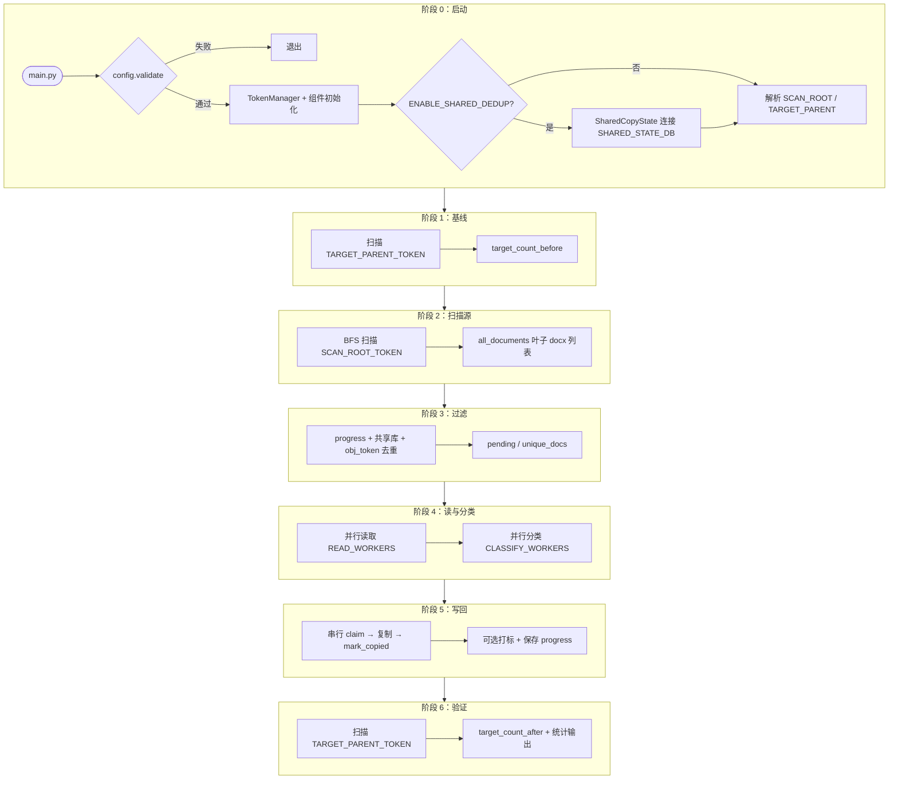
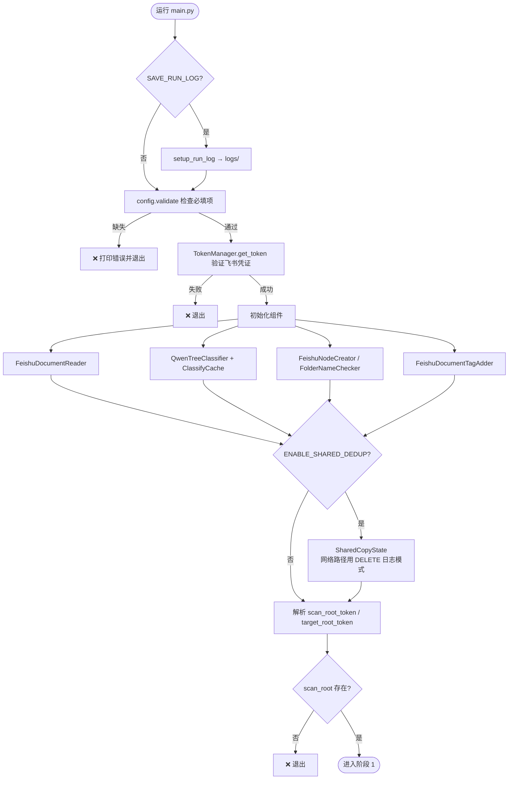
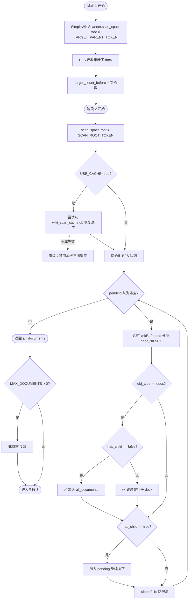
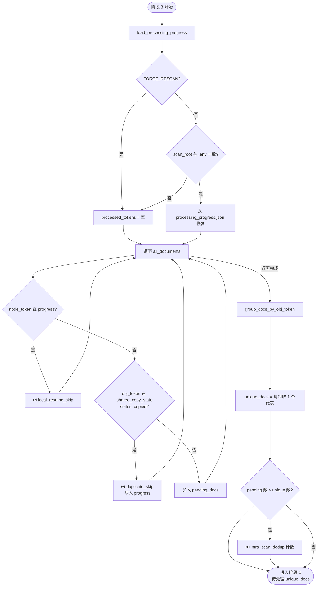
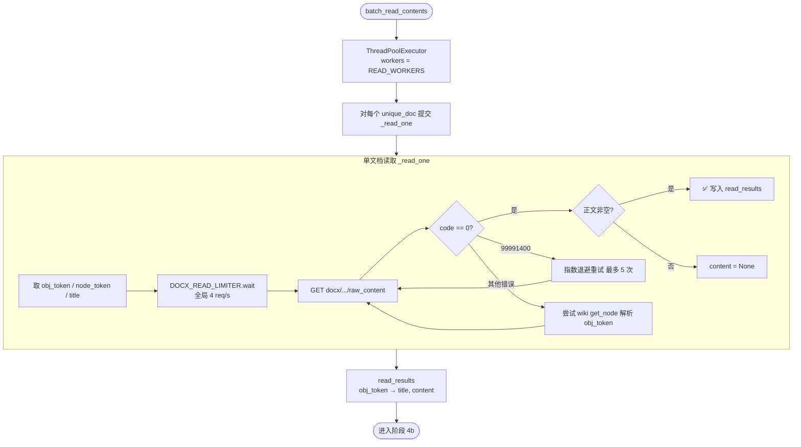
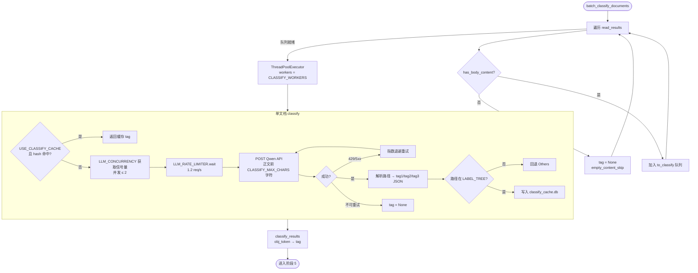
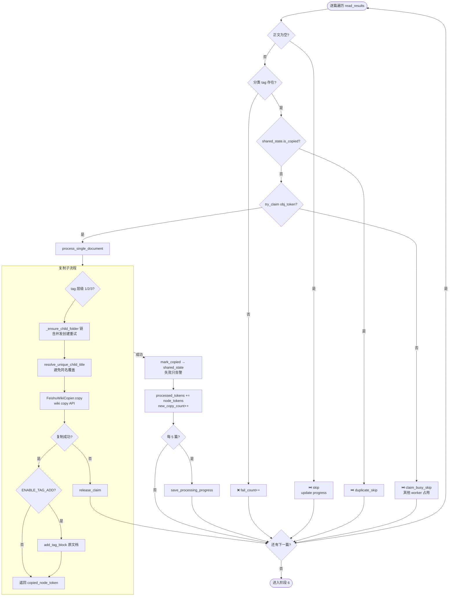
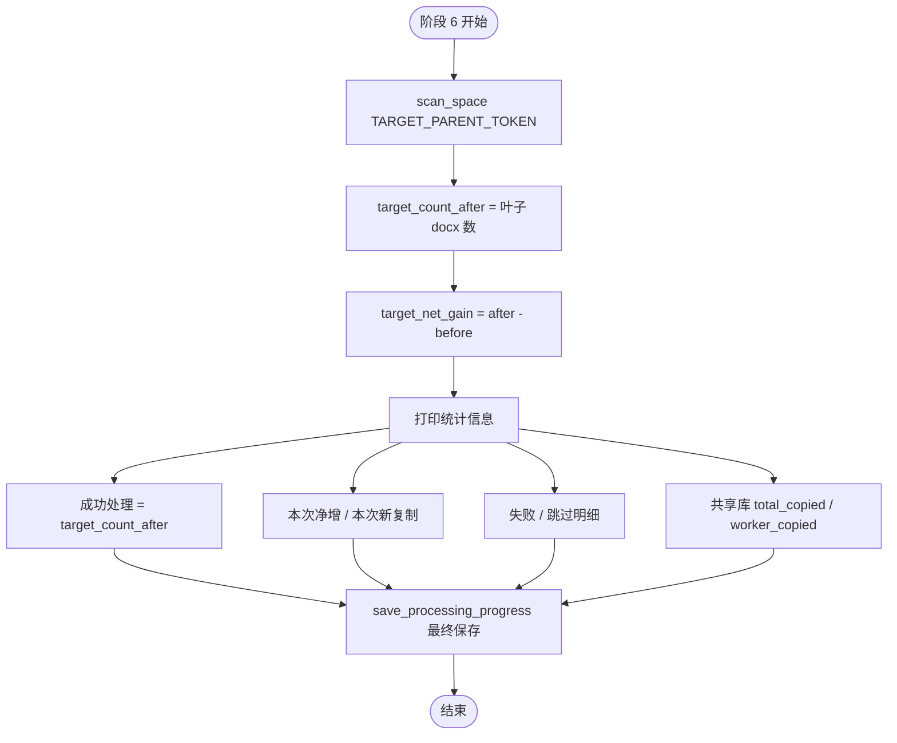
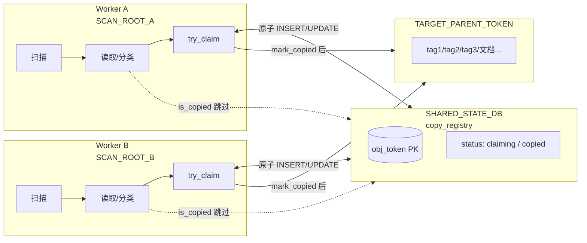
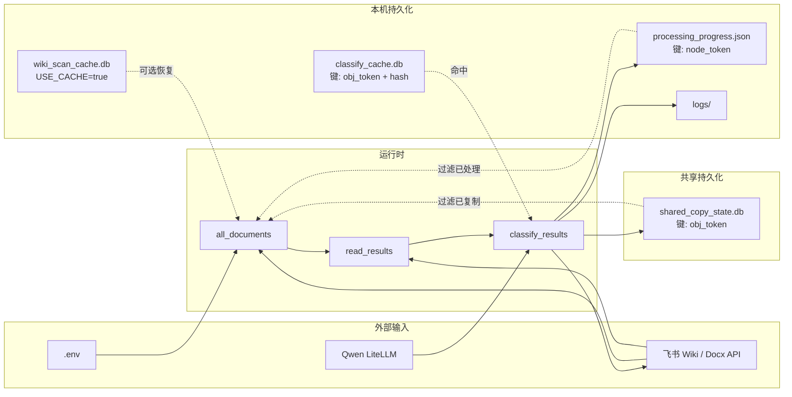

# AI DocClassifier 系统说明文档

> 飞书知识库文档自动分类系统  
> 版本：`feature/multi-worker-parallel` 分支  
> 更新日期：2026-06-17

---

## 目录

1. [系统概述](#一系统概述)
2. [项目结构](#二项目结构)
3. [运行流程](#三运行流程)
4. [增量更新与去重](#四增量更新与去重)
5. [多人并行协作](#五多人并行协作)
6. [配置参数](#六配置参数)
7. [统计口径](#七统计口径)
8. [运行时文件](#八运行时文件)
9. [分类机制](#九分类机制)
10. [性能与限流](#十性能与限流)
11. [常见问题与排障](#十一常见问题与排障)
12. [快速启动](#十二快速启动)
13. [附录：各阶段逻辑图](#附录各阶段逻辑图)

---

## 一、系统概述

### 1.1 做什么

本系统自动整理飞书知识库文档：

1. 在**源目录**（`SCAN_ROOT_TOKEN`）下 BFS 扫描**叶子 docx**（`has_child=false`）
2. 读取正文，调用 **Qwen LLM** 按预定义标签树分类
3. 在**目标目录**（`TARGET_PARENT_TOKEN`）下按分类创建文件夹并**复制**文档
4. 可选：在**原文档**插入分类标签块（`ENABLE_TAG_ADD`）

### 1.2 架构特点

```
扫描（单线程 BFS）
  → 并行读取正文（READ_WORKERS，飞书限速）
  → 并行 AI 分类（CLASSIFY_WORKERS，LLM 全局并发≤2）
  → 串行复制 + 打标（避免飞书写冲突）
  → 扫描目标目录验证数量
```

### 1.3 分支说明

| 分支 | 说明 |
|------|------|
| `master` | 早期单机版本 |
| **`feature/multi-worker-parallel`** | 当前主开发分支：多人并行、`obj_token` 去重、目标目录验证统计、共享库容错 |

---

## 二、项目结构

| 模块 | 文件 | 职责 |
|------|------|------|
| 入口 | `main.py` | 流程编排、并行调度、进度与统计 |
| 配置 | `config.py` | 从 `.env` 加载环境变量 |
| Token | `token_manager.py` | 飞书 `tenant_access_token` 自动刷新 |
| 扫描 | `wiki_scanner.py` | BFS 遍历 wiki，仅收集叶子 docx；可选扫描缓存 |
| 读文档 | `read_feishu_doc.py` | 调用 docx API 获取正文；限流重试 |
| 分类 | `qwen_classifier.py` | 标签树 + Qwen API 分类 |
| 分类缓存 | `classify_cache.py` | SQLite 缓存分类结果（按 `obj_token` + 内容 hash） |
| **共享去重** | **`shared_state.py`** | 跨 worker 的 `obj_token` 复制注册表（SQLite） |
| 文件夹 | `create_feishu_node.py` / `feishu_title_check.py` | 创建/查找文件夹；同名标题自动重命名 |
| 复制 | `copy_doc.py` | wiki copy API |
| 打标 | `add_tag_block.py` | 原文档插入标签块 |
| 飞书限速 | `feishu_rate_limit.py` | 读文档全局 4 req/s |
| LLM 限速 | `llm_rate_limit.py` | LLM 并发≤2，约 1.2 req/s |
| 日志 | `run_logging.py` | 终端输出写入 `logs/` |

---

## 三、运行流程

### 步骤 1：启动与校验

- `config.validate()` 检查必填项
- 初始化 `TokenManager`、Reader、Classifier、Copier 等
- 若 `ENABLE_SHARED_DEDUP=true`，连接 `SHARED_STATE_DB`

### 步骤 2：解析目录

- **扫描源**：`SCAN_ROOT_TOKEN` 或 `SCAN_FOLDER_NAME`
- **复制目标**：`TARGET_PARENT_TOKEN` → `TARGET_ROOT_NAME` → `FALLBACK_PARENT_TOKEN`

### 步骤 3：目标目录基线统计

- 递归扫描 `TARGET_PARENT_TOKEN` 下叶子 docx 数 → `target_count_before`

### 步骤 4：扫描源目录

- BFS 遍历，仅收集 `obj_type=docx` 且 `has_child=false` 的节点
- 非叶子 docx（目录/索引页）跳过
- `USE_CACHE=true` 时写入 `wiki_scan_cache.db`（扫描中断可续扫；写失败自动降级）

### 步骤 5：过滤与去重

按以下顺序过滤待处理文档：

| 顺序 | 条件 | 说明 |
|------|------|------|
| 1 | `node_token` 在 `processing_progress.json` | 本机断点续跑（按 `SCAN_ROOT_TOKEN` 区分） |
| 2 | `obj_token` 在 `shared_copy_state.db` 且 status=copied | 全局已复制（多人并行） |
| 3 | 同一扫描内重复 `obj_token` | 快捷方式/重复引用合并为一次 |

### 步骤 6：并行读取 + 并行分类

- **读取**：`READ_WORKERS` 线程，全局限速 4 req/s，遇 `99991400` 自动重试
- **分类**：正文为空跳过；有正文则调 LLM；`classify_cache.db` 可命中缓存

### 步骤 7：串行复制 + 打标

对每篇分类成功的文档：

1. `try_claim(obj_token)` — 防止多 worker 同时复制
2. 按 tag 层级（1～3 级）查找或创建文件夹链（并发创建失败自动重试）
3. 目标子目录已有同名文档 → 自动重命名为 `标题 (2)`、`标题 (3)` …
4. wiki copy API 复制
5. `mark_copied()` 写入共享库（失败只告警，不中断；本地进度仍保存）
6. 可选：原文档打标
7. 每 5 篇保存 `processing_progress.json`

### 步骤 8：验证统计

- 再次扫描目标目录 → `target_count_after`
- 输出「成功处理 = 目标目录实际叶子文档数」等指标

---

## 四、增量更新与去重

### 4.1 三层机制

| 层级 | 存储 | 键 | 作用 |
|------|------|-----|------|
| 本机断点 | `processing_progress.json` | 源 `node_token` | 同一 `SCAN_ROOT_TOKEN` 下已成功复制过的节点 |
| 全局去重 | `shared_copy_state.db` | `obj_token` | 跨 worker、跨源目录，同一文档只复制一次 |
| 扫描内去重 | 内存 | `obj_token` | 同一扫描根下多个快捷方式只处理一次 |

### 4.2 增量行为（重要）

**在 `SCAN_ROOT_TOKEN` 和 `TARGET_PARENT_TOKEN` 不变的前提下：**

- 源目录**新增**叶子 docx → 下次运行**只处理新增部分**
- 已成功复制的**不会**重复读、分类、复制
- **扫描仍会全量执行**（发现新增节点，约数分钟），处理阶段才是增量的

### 4.3 不会自动增量的情况

| 操作 | 后果 | 处理 |
|------|------|------|
| 更换 `TARGET_PARENT_TOKEN` | 本地 progress 仍跳过已处理 node | 设 `FORCE_RESCAN=true` 或删 `processing_progress.json` |
| 更换 `SCAN_ROOT_TOKEN` | progress 自动清空 | 正常，会重跑新源目录 |
| 删除共享库 | 全局去重丢失 | 可能重复复制；保留 `processing_progress.json` 可部分避免 |
| 中断在**读取阶段** | progress 未更新 | 下次重新读取（不重复复制已完成的） |

---

## 五、多人并行协作

### 5.1 分工模型

```
同事 A ── SCAN_ROOT_A ──┐
同事 B ── SCAN_ROOT_B ──┼──► 同一 TARGET_PARENT_TOKEN
同事 C ── SCAN_ROOT_C ──┘         ▲
                                  │
                    SHARED_STATE_DB（共享去重）
```

### 5.2 必须一致 vs 可以不同

| 必须一致 | 可以不同 |
|----------|----------|
| `SPACE_ID` | `FEISHU_APP_ID` / `FEISHU_APP_SECRET` |
| `TARGET_PARENT_TOKEN` | `SCAN_ROOT_TOKEN` |
| `SHARED_STATE_DB` 路径 | `WORKER_ID` |
| 同一飞书租户 | `QWEN_API_KEY` |

**不同 App ID 的好处：** 飞书 API 限流按应用计频，多人用不同 App 可分摊读文档配额（约 5 req/s/App）。

### 5.3 共享文件夹配置（Windows）

**主机：**

```env
WORKER_ID=hydrew
SCAN_ROOT_TOKEN=token_A
TARGET_PARENT_TOKEN=GPFewOUJ1iGBrGks7R7cB137nDh
SHARED_STATE_DB=F:\shared_db\shared_copy_state.db
ENABLE_SHARED_DEDUP=true
READ_WORKERS=2
```

**同事（UNC 路径）：**

```env
WORKER_ID=bob
SCAN_ROOT_TOKEN=token_B
TARGET_PARENT_TOKEN=GPFewOUJ1iGBrGks7R7cB137nDh
SHARED_STATE_DB=\\HOSTNAME\shared_db\shared_copy_state.db
ENABLE_SHARED_DEDUP=true
READ_WORKERS=2
```

共享文件夹需给同事**修改**权限。程序会自动检测网络路径并使用 `DELETE` 日志模式（不用 WAL），降低 SQLite 损坏风险。

### 5.4 对账

- 各 worker「本次新复制」之和 ≈ 目标目录净增（若开始时目标为空）
- 任一 worker 结束时的「目标目录实际数」为**全量**（含其他人已写入的）
- 以**全部跑完后**最后一次扫描为准

---

## 六、配置参数

所有配置通过项目根目录 `.env` 加载（`config.py` 读取）。**敏感信息不要提交 Git。**

### 6.1 必填

| 参数 | 说明 |
|------|------|
| `FEISHU_APP_ID` / `FEISHU_APP_SECRET` | 飞书应用凭证 |
| `SPACE_ID` | 知识库空间 ID |
| `QWEN_API_KEY` | LLM API Key |
| `SCAN_ROOT_TOKEN` 或 `SCAN_FOLDER_NAME` | 扫描源（二选一） |
| `TARGET_PARENT_TOKEN` 或 `TARGET_ROOT_NAME` | 复制目标（二选一） |

### 6.2 多人并行

| 参数 | 默认值 | 说明 |
|------|--------|------|
| `ENABLE_SHARED_DEDUP` | `true` | 启用跨 worker `obj_token` 去重 |
| `SHARED_STATE_DB` | `shared_copy_state.db` | 共享 SQLite 路径（多人时用共享盘） |
| `WORKER_ID` | `主机名-PID` | 执行者标识，每人应不同 |
| `CLAIM_TIMEOUT_MINUTES` | `30` | 复制占位超时（分钟） |

### 6.3 行为控制

| 参数 | 默认值 | 说明 |
|------|--------|------|
| `USE_CACHE` | `false` | wiki 扫描 SQLite 缓存（`wiki_scan_cache.db`） |
| `SAVE_PROGRESS` | `true` | 保存本机进度到 `processing_progress.json` |
| `FORCE_RESCAN` | `false` | 忽略 progress，全量重跑 |
| `ENABLE_TAG_ADD` | `true` | 复制后在原文档插入标签块 |
| `MAX_DOCUMENTS` | 无限制 | 测试用：只处理前 N 篇 |
| `SAVE_RUN_LOG` | `true` | 日志写入 `logs/` |

### 6.4 性能调优

| 参数 | 默认值 | 建议 | 说明 |
|------|--------|------|------|
| **`READ_WORKERS`** | **`2`** | **`2`** | 并行读正文线程数；过高易触发飞书限流 `99991400` |
| `CLASSIFY_WORKERS` | `4` | 保持 4 | 分类线程数；实际 LLM 并发被限制为 2，改小无益 |
| `CLASSIFY_MAX_CHARS` | `3000` | — | 送入 LLM 的正文最大字符数 |
| `USE_CLASSIFY_CACHE` | `true` | — | 分类结果 SQLite 缓存 |
| `LLM_MAX_RETRIES` | `6` | — | LLM 失败重试次数 |
| `LLM_REQUEST_TIMEOUT` | `120` | — | LLM 单次超时（秒） |
| `PROGRESS_INTERVAL` | `10` | — | 批量读/分类进度打印间隔 |

### 6.5 配置示例

**单人全量：**

```env
FEISHU_APP_ID=cli_xxx
FEISHU_APP_SECRET=xxx
SPACE_ID=7595802147485141976
SCAN_ROOT_TOKEN=JUWxwwvfJiLWQvk9HLHc3b24nie
TARGET_PARENT_TOKEN=GPFewOUJ1iGBrGks7R7cB137nDh
QWEN_API_KEY=sk-xxx
READ_WORKERS=2
ENABLE_SHARED_DEDUP=false
```

**多人并行：**

```env
WORKER_ID=alice
SCAN_ROOT_TOKEN=token_A
TARGET_PARENT_TOKEN=GPFewOUJ1iGBrGks7R7cB137nDh
SHARED_STATE_DB=\\HOSTNAME\shared_db\shared_copy_state.db
ENABLE_SHARED_DEDUP=true
READ_WORKERS=2
```

---

## 七、统计口径

程序结束时输出以下指标，**以避免「成功次数之和 ≠ 目标目录实际数」的误解：**

| 指标 | 含义 |
|------|------|
| **成功处理（目标目录实际叶子文档数）** | 结束时递归扫描 `TARGET_PARENT_TOKEN` 的叶子 docx 总数 |
| **本次净增（验证）** | `target_count_after - target_count_before` |
| **本次新复制（本 worker）** | 本进程本次成功复制篇数 |
| **跳过：全局去重** | 共享库中已有 `obj_token` |
| **跳过：并发占用** | 其他 worker 正在 `claiming` |
| **共享库累计已复制** | 全 worker 写入共享库的总数 |

> 三人各报 success 相加 ≠ 目标目录文档数。正确对账看**目标目录实际扫描数**或**共享库累计**。

---

## 八、运行时文件

| 文件 | 条件 | 用途 | Git |
|------|------|------|-----|
| `.env` | 手动创建 | 本地配置 | 忽略 |
| `processing_progress.json` | `SAVE_PROGRESS=true` | 本机断点（按 `SCAN_ROOT_TOKEN`） | 忽略 |
| `shared_copy_state.db` | `ENABLE_SHARED_DEDUP=true` | 全局去重（建议放共享盘） | 忽略 |
| `classify_cache.db` | `USE_CLASSIFY_CACHE=true` | AI 分类缓存 | 忽略 |
| `wiki_scan_cache.db` | `USE_CACHE=true` | 扫描 BFS 断点 | 忽略 |
| `scanned_documents_*.json` | `USE_CACHE=true` | 扫描结果快照 | 忽略 |
| `logs/latest.log` | `SAVE_RUN_LOG=true` | 运行日志 | 忽略 |

### 重置测试环境

删除以下文件即可全量重跑（**保留 `.env`**）：

```powershell
Remove-Item processing_progress.json, classify_cache.db, wiki_scan_cache.db, shared_copy_state.db -ErrorAction SilentlyContinue
Remove-Item scanned_documents_*.json -ErrorAction SilentlyContinue
# 共享盘上的 shared_copy_state.db 及 -wal/-shm 也需删除
```

或设 `FORCE_RESCAN=true`（仅忽略本机 progress，不清理共享库与分类缓存）。

---

## 九、分类机制

### 9.1 标签树

分类依据 `qwen_classifier.py` 中硬编码的 `LABEL_TREE`，顶层包括 `Cellular`、`Automotive`、`Smart` 等，最深 3 级。LLM 必须从树中选择路径，无效路径回退 `Others`。

### 9.2 输出格式

```json
{"tag1": ["Smart"], "tag2": ["BSP"], "tag3": ["I2C/UART/SPI/CAN"]}
```

| 层级 | 目标目录结构 |
|------|-------------|
| 1 级 | `TARGET_PARENT / tag1 / 文档` |
| 2 级 | `TARGET_PARENT / tag1 / tag2 / 文档` |
| 3 级 | `TARGET_PARENT / tag1 / tag2 / tag3 / 文档` |

### 9.3 空文档三层防护

1. 扫描：非叶子 docx 不进入列表
2. 分类：`has_body_content()` 为 false 不调 LLM
3. 分类器：`classify()` 内再次检查

---

## 十、性能与限流

### 10.1 飞书 API

| 阶段 | 接口 | 限制与对策 |
|------|------|-----------|
| 扫描 | `wiki/.../nodes` | BFS 单线程 + sleep 0.1s |
| **读取** | **`docx/.../raw_content`** | **约 5 req/s/App**；代码限速 4 req/s；`READ_WORKERS=2` |
| 复制/建文件夹 | `wiki/.../copy`, `nodes` | 串行执行 |

**限流错误码：** `99991400`（HTTP 400）→ 自动指数退避重试（最多 5 次）。

**缓解措施（按优先级）：**

1. `.env` 设 `READ_WORKERS=2`
2. 多人并行时使用**不同** `FEISHU_APP_ID`
3. 避免同一 App 多进程同时大量读文档

### 10.2 LLM API

| 限制 | 值 | 配置 |
|------|-----|------|
| 并发 | ≤ 2 | `llm_rate_limit.py` 硬编码 |
| 速率 | 1.2 req/s | `llm_rate_limit.py` 硬编码 |
| 线程池 | `CLASSIFY_WORKERS`（默认 4） | 多出的线程等待，无需改小 |

出现 LLM 502/503 时，可调低 `llm_rate_limit.py` 中的 QPS 或 `LLM_MAX_RETRIES`。

### 10.3 耗时预估（1436 篇量级）

| 阶段 | 大致耗时 |
|------|----------|
| 扫描源目录 | 4～6 分钟 |
| 读取 1400+ 篇 | 6～10 分钟（视限流） |
| AI 分类 | 数小时（约 1.2 篇/秒有效吞吐） |
| 复制 + 打标 | 数小时（串行，约 1～2 篇/分钟） |

---

## 十一、常见问题与排障

### Q1：运行很快结束，但目标目录为空？

- 检查 `processing_progress.json` 是否已有大量 `node_token`（断点跳过）
- 检查是否更换了 `TARGET_PARENT_TOKEN` 但 progress 未清空
- 处理：删 progress 或 `FORCE_RESCAN=true`

### Q2：飞书限流 `99991400` 频繁出现？

- 设 `READ_WORKERS=2`
- 多人用不同 App ID
- 属正常现象，程序会自动重试；读取阶段中断则需重跑读取

### Q3：`database disk image is malformed`？

- 多见于 **SMB 共享盘**上的 `shared_copy_state.db`
- 删除 `.db` 及 `-wal`、`-shm` 后重跑；新版本已禁用网络路径 WAL 并自动重建
- 共享库写入失败**不会**导致已复制文档丢失（本地 progress 仍保存）

### Q4：`attempt to write a readonly database`（wiki_scan_cache）？

- `USE_CACHE=true` 时扫描缓存不可写
- 程序会自动降级为无缓存扫描；或设 `USE_CACHE=false`

### Q5：success 相加与目标目录文档数不一致？

- 跨源目录重复 `obj_token`、同名标题覆盖、统计口径不同
- 以结束时「**目标目录实际叶子文档数**」为准

### Q6：如何只测试 10 篇？

```env
MAX_DOCUMENTS=10
```

### Q7：如何中断程序？

终端 `Ctrl+C` 或结束 `python main.py` 进程。复制阶段每 5 篇保存 progress；读取阶段中断不保存读取进度。

---

## 十二、快速启动

```powershell
# 1. 环境
python -m venv .venv
.venv\Scripts\activate
pip install -r requirements.txt

# 2. 配置
copy .env.example .env
# 编辑 .env

# 3. 校验
.venv\Scripts\python.exe -c "import config; config.validate(); print('OK')"

# 4. 运行
.venv\Scripts\python.exe main.py
```

### 拉取最新代码（多人协作）

```powershell
git fetch origin
git checkout feature/multi-worker-parallel
git pull origin feature/multi-worker-parallel
```

---

## 附录：各阶段逻辑图

> 使用 Mermaid 语法，可在 VS Code、GitHub、Typora 等编辑器中渲染。

### A.1 系统总览（阶段串联）



---

### A.2 阶段 0：启动与初始化



---

### A.3 阶段 1 & 2：目标基线 + 源目录扫描



---

### A.4 阶段 3：过滤、断点续跑与去重



---

### A.5 阶段 4a：并行读取正文



---

### A.6 阶段 4b：并行 AI 分类



---

### A.7 阶段 5：串行复制与打标



---

### A.8 阶段 6：验证统计与输出



---

### A.9 多人并行协调（SharedCopyState）



**协调规则：**

- 同一 `obj_token` 只允许一条 `copied` 记录
- `try_claim` 失败 → 其他 worker 正在处理，本 worker 跳过
- `claiming` 超时（默认 30 分钟）→ 自动清理，允许重新抢占
- 网络共享盘使用 `DELETE` 日志模式，损坏时自动重建

---

### A.10 持久化与缓存数据流



---

*文档对应仓库：`AI_DocClassifier` · 分支 `feature/multi-worker-parallel`*
