# AI DocClassifier 系统说明文档

> 飞书知识库文档自动分类系统  
> 版本：`feature/scan-folders-batch` 分支  
> 更新日期：2026-07-27  
> 操作手册：[QUICK_START.md](QUICK_START.md)

---

## 目录

1. [系统概述](#一系统概述)
2. [项目结构](#二项目结构)
3. [运行流程](#三运行流程)
4. [增量更新与去重](#四增量更新与去重)
5. [多人并行协作](#五多人并行协作)
6. [配置参数](#六配置参数)
7. [统计口径](#七统计口径)
8. [运行时文件](#八运行时文件)
9. [分类机制](#九分类机制)
10. [性能与限流](#十性能与限流)
11. [常见问题与排障](#十一常见问题与排障)
12. [快速启动](#十二快速启动)
13. [附录：各阶段逻辑图](#附录各阶段逻辑图)

---

## 一、系统概述

### 1.1 做什么

本系统自动整理飞书知识库文档：

1. 在**源目录**（`SCAN_ROOT_TOKEN`）下 BFS 扫描**叶子 docx**（`has_child=false`）
2. 可选：将文档内 **PDF/Word/PPT 附件**提取为文本写回源文档（`ENABLE_ATTACHMENT_EXTRACT`）
3. 读取正文，调用 **LLM**（经 OpenAI 兼容网关，默认 `deepseek-v4-flash`）按预定义标签树分类
4. 在**目标目录**（`TARGET_PARENT_TOKEN`）下按分类创建文件夹并**复制**文档
5. 可选：在**原文档**插入分类标签块（`ENABLE_TAG_ADD`）

### 1.2 架构特点

```
扫描（单线程 BFS）
  → [可选] 附件提取写回源文档（PDF/Word/PPT）
  → 并行读取正文（READ_WORKERS，飞书限速）
  → 并行 AI 分类（CLASSIFY_WORKERS，LLM 全局并发≤2）
  → 串行复制 + 打标（避免飞书写冲突）
  → 扫描目标目录验证数量
```

### 1.3 分支说明

详见 [docs/BRANCHES.md](BRANCHES.md)。

| 分支 | 说明 |
|------|------|
| `master` | 早期单机版本 |
| `feature/multi-worker-parallel` | 多人并行、共享去重、目标目录验证统计 |
| `feature/scan-snapshot-plan-b` | 扫描快照增量、排除类规则、分类失败清单 |
| `feature/attachment-extract` | 附件提取合入主流程 |
| `feature/classify-quality-restructure` | 包结构重组 + 分类质量/分卷/Others 纠偏 |
| **`feature/scan-folders-batch`** | **源文件夹清单批量增量 + Others 主题归档（当前推荐）** |

---

## 二、项目结构

详见 [PROJECT_STRUCTURE.md](PROJECT_STRUCTURE.md)。

| 模块 | 路径 | 职责 |
|------|------|------|
| 入口 | `main.py` | 流程编排、并行调度、进度与统计 |
| 配置 | `config.py` | 从 `.env` 加载环境变量 |
| Token | `feishu/token_manager.py` | 飞书 `tenant_access_token` 自动刷新 |
| 扫描 | `feishu/wiki_scanner.py` | BFS 遍历 wiki，仅收集叶子 docx |
| 读文档 | `feishu/read_doc.py` | 调用 docx API 获取正文 |
| **附件提取** | **`attachment/extractor.py`** | PDF/Word/PPT 附件转文本写回源文档 |
| 附件格式 | `attachment/extractors/` | PDF / Word / PPT 提取器实现 |
| 分类 | `classify/llm_tree_classifier.py` | 标签树 + LLM 分类 |
| 分类缓存 | `classify/classify_cache.py` | SQLite 缓存分类结果 |
| **共享去重** | **`state/shared_state.py`** | 跨 worker 的 `obj_token` 复制注册表 |
| 分卷 | `state/folder_rollover.py` | 单层节点超限自动分卷 |
| 文件夹 | `feishu/create_feishu_node.py` / `feishu/title_check.py` | 创建/查找文件夹；同名标题重命名 |
| 复制 | `feishu/copy_doc.py` | wiki copy API |
| 移动 | `feishu/wiki_move.py` | wiki move API（Others 纠偏） |
| 打标 | `feishu/add_tag_block.py` | 原文档插入标签块 |
| 飞书限速 | `feishu/http.py` | 跨进程 + 本进程限速、自动重试 |
| LLM 限速 | `classify/llm_rate_limit.py` | LLM 并发≤2 |
| 运维脚本 | `tools/` | 附件重试、Others 移动纠偏 |
| 日志 | `util/run_logging.py` | 终端输出写入 `logs/` |

---

## 三、运行流程

### 步骤 1：启动与校验

- `config.validate()` 检查必填项
- 初始化 `TokenManager`、Reader、Classifier、Copier 等
- 若 `ENABLE_SHARED_DEDUP=true`，连接 `SHARED_STATE_DB`

### 步骤 2：解析目录

- **扫描源**：`SCAN_ROOT_TOKEN` 或 `SCAN_FOLDER_NAME`
- **复制目标**：`TARGET_PARENT_TOKEN` → `TARGET_ROOT_NAME` → `FALLBACK_PARENT_TOKEN`

### 步骤 3：目标目录基线统计

- 递归扫描 `TARGET_PARENT_TOKEN` 下叶子 docx 数 → `target_count_before`

### 步骤 4：扫描源目录

- BFS 遍历，仅收集 `obj_type=docx` 且 `has_child=false` 的节点
- 非叶子 docx（目录/索引页）跳过
- `USE_CACHE=true` 时写入 `wiki_scan_cache.db`（扫描中断可续扫；写失败自动降级）

### 步骤 5：过滤与去重

按以下顺序过滤待处理文档：

| 顺序 | 条件 | 说明 |
|------|------|------|
| 1 | `node_token` 在 `processing_progress.json` | 本机断点续跑（按 `SCAN_ROOT_TOKEN` 区分） |
| 2 | `obj_token` 在 `shared_copy_state.db` 且 status=copied | 全局已复制（多人并行） |
| 3 | 同一扫描内重复 `obj_token` | 快捷方式/重复引用合并为一次 |

### 步骤 5a：附件提取（可选）

当 `ENABLE_ATTACHMENT_EXTRACT=true` 时，在读取正文之前执行：

1. 扫描待处理 docx 的 blocks，识别 PDF / Word / PPT 附件（`block_type=23`）
2. 下载附件 → 提取文本（及图片）→ 以 `附件：{文件名}` 标题写回源文档
3. 已存在同名标题的附件跳过（防重复）
4. 输出进度、汇总统计，并写入 `logs/attachment_extract.json`

**依赖：** `PyMuPDF`、`python-docx`、`lxml`、`python-pptx`  
**权限：** 需对源文档具备编辑权限（写入 docx 块、下载附件）

### 步骤 6：并行读取 + 并行分类

- **读取**：`READ_WORKERS` 线程，全局限速 4 req/s，遇 `99991400` 自动重试
- **分类**：正文为空跳过；有正文则调 LLM；`classify_cache.db` 可命中缓存

### 步骤 7：串行复制 + 打标

对每篇分类成功的文档：

1. `try_claim(obj_token)` — 防止多 worker 同时复制
2. 按 tag 层级（1～3 级）查找或创建文件夹链（并发创建失败自动重试）
3. 目标子目录已有同名文档 → 自动重命名为 `标题 (2)`、`标题 (3)` …
4. wiki copy API 复制
5. `mark_copied()` 写入共享库（失败只告警，不中断；本地进度仍保存）
6. 可选：原文档打标
7. 每 5 篇保存 `processing_progress.json`

### 步骤 8：验证统计

- 再次扫描目标目录 → `target_count_after`
- 输出「成功处理 = 目标目录实际叶子文档数」等指标

---

## 四、增量更新与去重

### 4.1 四层机制

| 层级 | 存储 | 键 | 作用 |
|------|------|-----|------|
| **扫描快照** | `scan_snapshot.db` | 源 `node_token` | 方案 B：记录已知叶子，增量模式只处理新增 + 失败重试 |
| 本机断点 | `processing_progress.json` | 源 `node_token` | 同一 `SCAN_ROOT_TOKEN` 下已成功复制过的节点 |
| 全局去重 | `shared_copy_state.db` | `obj_token` | 跨 worker、跨源目录，同一文档只复制一次 |
| 扫描内去重 | 内存 | `obj_token` | 同一扫描根下多个快捷方式只处理一次 |

相关配置：`ENABLE_SCAN_SNAPSHOT`（默认 true）、`FULL_SCAN_CALIBRATION_DAYS`（默认 7）、`FORCE_RESCAN`。

### 4.2 增量行为（重要）

**在 `SCAN_ROOT_TOKEN` 和 `TARGET_PARENT_TOKEN` 不变的前提下：**

- 源目录**新增**叶子 docx → 下次运行**只处理新增部分**（及上次失败项）
- 已成功复制的**不会**重复读、分类、复制
- **扫描仍会全量 BFS**（v1 尚未做差量 BFS）；**处理阶段**在快照增量模式下会跳过已成功的旧叶子

### 4.3 不会自动增量的情况

| 操作 | 后果 | 处理 |
|------|------|------|
| 更换 `TARGET_PARENT_TOKEN` | 本地 progress 仍跳过已处理 node | 设 `FORCE_RESCAN=true` 或删 `processing_progress.json` |
| 更换 `SCAN_ROOT_TOKEN` | progress 自动清空 | 正常，会重跑新源目录 |
| 删除共享库 | 全局去重丢失 | 可能重复复制；保留 `processing_progress.json` 可部分避免 |
| 中断在**读取阶段** | progress 未更新 | 下次重新读取（不重复复制已完成的） |

---

## 五、多人并行协作

### 5.1 分工模型

**推荐（清单模式）：** 在 `scan_folders.json` 中登记全部源文件夹 token，并用 `assignee` / `assignees` 对应各人 `.env` 的 `WORKER_ID`。每人执行：

```powershell
python main.py --list-folders
python main.py --all-assigned
```

一人承担全部目录时，把所有条目的 `assignee` 设为同一 `WORKER_ID`，然后 `--all-assigned` 即可顺序增量更新。

```
scan_folders.json
  ├── folder A  assignee=Hydrew ──┐
  ├── folder B  assignee=Hydrew ──┼──► 同一 TARGET_PARENT_TOKEN
  └── folder C  assignee=Alice  ──┘         ▲
                                            │
                              SHARED_STATE_DB（共享去重）
```

**兼容（旧方式）：** 每人 `.env` 只配一个 `SCAN_ROOT_TOKEN`，改 token 后重跑。

```
同事 A ── SCAN_ROOT_A ──┐
同事 B ── SCAN_ROOT_B ──┼──► 同一 TARGET_PARENT_TOKEN
同事 C ── SCAN_ROOT_C ──┘
```

### 5.2 必须一致 vs 可以不同

| 必须一致 | 可以不同 |
|----------|----------|
| `SPACE_ID` | `FEISHU_APP_ID` / `FEISHU_APP_SECRET` |
| `TARGET_PARENT_TOKEN` | 清单中的 `assignee` / 或 `SCAN_ROOT_TOKEN` |
| `SHARED_STATE_DB` 路径 | `WORKER_ID` |
| 同一飞书租户 | `LLM_API_KEY` |
| `scan_folders.json`（或共享盘同一份） | 本机 `SCAN_FOLDERS_FILE` 路径 |

**不同 App ID 的好处：** 飞书 API 限流按应用计频，多人用不同 App 可分摊读文档配额（约 5 req/s/App）。

### 5.3 共享文件夹配置（Windows）

**推荐：** 直接 `copy .env.example .env`，模板已按 3～5 人并行预设共享路径与限速参数。

```env
WORKER_ID=Hydrew
# SCAN_ROOT_TOKEN=   # 清单模式下可留空
SCAN_FOLDERS_FILE=scan_folders.json
TARGET_PARENT_TOKEN=GPFewOUJ1iGBrGks7R7cB137nDh
SHARED_STATE_DB=\\HF-D-006494B\shared_db\shared_copy_state.db
FEISHU_RATE_LIMIT_DB=\\HF-D-006494B\shared_db\feishu_rate_limit.db
ENABLE_SHARED_DEDUP=true
ENABLE_CROSS_PROCESS_FEISHU_LIMIT=true
FEISHU_GLOBAL_MAX_PER_SECOND=10
FEISHU_LOCAL_MAX_PER_SECOND=3
READ_WORKERS=2
CLASSIFY_WORKERS=3
```

**同事：** 同上，改 `WORKER_ID`、`FEISHU_APP_*`、`LLM_API_KEY`；源目录由清单 `assignee` 决定，无需再改单个 token。

共享文件夹需给同事**修改**权限。程序会自动检测网络路径并使用 `DELETE` 日志模式（不用 WAL），降低 SQLite 损坏风险。

### 5.4 对账

- 各 worker「本次新复制」之和 ≈ 目标目录净增（若开始时目标为空）
- 任一 worker 结束时的「目标目录实际数」为**全量**（含其他人已写入的）
- 以**全部跑完后**最后一次扫描为准

---

## 六、配置参数

所有配置通过项目根目录 `.env` 加载（`config.py` 读取）。**敏感信息不要提交 Git。**

### 6.1 必填

| 参数 | 说明 |
|------|------|
| `FEISHU_APP_ID` / `FEISHU_APP_SECRET` | 飞书应用凭证 |
| `SPACE_ID` | 知识库空间 ID |
| `LLM_API_KEY` | LLM 网关 API Key（兼容旧名 `QWEN_API_KEY`） |
| `LLM_MODEL` | 分类模型名，默认 `deepseek-v4-flash` |
| `LLM_BASE_URL` | 网关地址，默认 `https://qlitellm.phicotek.com/v1` |
| `SCAN_ROOT_TOKEN` / `SCAN_FOLDER_NAME` / `scan_folders.json` | 扫描源（三选一；推荐清单） |
| `TARGET_PARENT_TOKEN` 或 `TARGET_ROOT_NAME` | 复制目标（二选一） |

### 6.1.1 源文件夹清单（推荐）

| 参数 / 文件 | 说明 |
|-------------|------|
| `scan_folders.json` | 全部源目录 `id` / `name` / `token` / `assignee` / `enabled` |
| `SCAN_FOLDERS_FILE` | 清单路径，默认 `scan_folders.json`；可指到共享盘 |
| `WORKER_ID` | 须与清单 `assignee` 一致，供 `--all-assigned` 过滤 |

```powershell
python main.py --list-folders
python main.py --all-assigned
python main.py --folder 25.Smart-FAE
python main.py --all-enabled
```

### 6.2 多人并行

| 参数 | 默认值 | 说明 |
|------|--------|------|
| `ENABLE_SHARED_DEDUP` | `true` | 启用跨 worker `obj_token` 去重 |
| `SHARED_STATE_DB` | `shared_copy_state.db` | 共享 SQLite 路径（多人时用共享盘） |
| `WORKER_ID` | `主机名-PID` | 执行者标识，每人应不同 |
| `CLAIM_TIMEOUT_MINUTES` | `30` | 复制占位超时（分钟） |

### 6.2.1 飞书 API 限速（多人并行）

| 参数 | 默认值 | 说明 |
|------|--------|------|
| `ENABLE_CROSS_PROCESS_FEISHU_LIMIT` | `true` | 跨 worker 全局飞书限速 |
| `FEISHU_RATE_LIMIT_DB` | 共享盘路径 | 与 `SHARED_STATE_DB` 同目录 |
| `FEISHU_GLOBAL_MAX_PER_SECOND` | `2`（模板 `10`） | 所有 worker 合计 req/s 上限 |
| `FEISHU_LOCAL_MAX_PER_SECOND` | `4`（模板 `3`） | 单 worker 本进程上限 |
| `FEISHU_API_MAX_RETRIES` | `5` | 超时/429/99991400 重试次数 |
| `FEISHU_API_TIMEOUT` | `90` | 普通 API 超时（秒） |
| `FEISHU_DOWNLOAD_TIMEOUT` | `180` | 附件下载超时（秒） |

**并行人数建议：** 3 人 → 6；4 人 → 8；5 人 → 10（模板值）。人数更少时可直接用模板值，更保守。

### 6.3 行为控制

| 参数 | 默认值 | 说明 |
|------|--------|------|
| `USE_CACHE` | `false` | wiki 扫描 SQLite 缓存（`wiki_scan_cache.db`） |
| `SAVE_PROGRESS` | `true` | 保存本机进度到 `processing_progress.json` |
| `FORCE_RESCAN` | `false` | 忽略 progress，全量重跑 |
| `ENABLE_TAG_ADD` | `true` | 复制后在原文档插入标签块 |
| `ENABLE_ATTACHMENT_EXTRACT` | `false` | 将 PDF/Word/PPT 附件提取为文本写回源文档 |
| `MAX_DOCUMENTS` | 无限制 | 测试用：只处理前 N 篇 |
| `SAVE_RUN_LOG` | `true` | 日志写入 `logs/` |

### 6.4 性能调优

| 参数 | 默认值 | 建议 | 说明 |
|------|--------|------|------|
| **`READ_WORKERS`** | **`2`** | **`2`** | 并行读正文线程数；过高易触发飞书限流 `99991400` |
| `CLASSIFY_WORKERS` | `4` | **3（多人）** | 分类线程数；实际 LLM 并发被限制为 2/进程 |
| `CLASSIFY_MAX_CHARS` | `3000` | — | 送入 LLM 的正文最大字符数 |
| `LLM_MODEL` | `deepseek-v4-flash` | — | LLM 模型名（换模型只改此项） |
| `LLM_BASE_URL` | `https://qlitellm.phicotek.com/v1` | — | OpenAI 兼容网关地址 |
| `USE_CLASSIFY_CACHE` | `true` | — | 分类结果 SQLite 缓存 |
| `LLM_MAX_RETRIES` | `6` | — | LLM 失败重试次数 |
| `LLM_REQUEST_TIMEOUT` | `120` | — | LLM 单次超时（秒） |
| `PROGRESS_INTERVAL` | `10` | — | 批量读/分类进度打印间隔 |

### 6.5 配置示例

**单人全量：**

```env
FEISHU_APP_ID=cli_xxx
FEISHU_APP_SECRET=xxx
SPACE_ID=7595802147485141976
SCAN_ROOT_TOKEN=JUWxwwvfJiLWQvk9HLHc3b24nie
TARGET_PARENT_TOKEN=GPFewOUJ1iGBrGks7R7cB137nDh
LLM_API_KEY=sk-xxx
LLM_MODEL=deepseek-v4-flash
READ_WORKERS=2
ENABLE_SHARED_DEDUP=false
```

**多人并行：**

```env
WORKER_ID=alice
SCAN_ROOT_TOKEN=token_A
TARGET_PARENT_TOKEN=GPFewOUJ1iGBrGks7R7cB137nDh
SHARED_STATE_DB=\\HOSTNAME\shared_db\shared_copy_state.db
ENABLE_SHARED_DEDUP=true
READ_WORKERS=2
```

---

## 七、统计口径

程序结束时输出以下指标，**以避免「成功次数之和 ≠ 目标目录实际数」的误解：**

| 指标 | 含义 |
|------|------|
| **成功处理（目标目录实际叶子文档数）** | 结束时递归扫描 `TARGET_PARENT_TOKEN` 的叶子 docx 总数 |
| **本次净增（验证）** | `target_count_after - target_count_before` |
| **本次新复制（本 worker）** | 本进程本次成功复制篇数 |
| **跳过：全局去重** | 共享库中已有 `obj_token` |
| **跳过：并发占用** | 其他 worker 正在 `claiming` |
| **共享库累计已复制** | 全 worker 写入共享库的总数 |

> 三人各报 success 相加 ≠ 目标目录文档数。正确对账看**目标目录实际扫描数**或**共享库累计**。

---

## 八、运行时文件

| 文件 | 条件 | 用途 | Git |
|------|------|------|-----|
| `.env` | 手动创建 | 本地配置 | 忽略 |
| `processing_progress.json` | `SAVE_PROGRESS=true` | 本机断点（按 `SCAN_ROOT_TOKEN`） | 忽略 |
| `shared_copy_state.db` | `ENABLE_SHARED_DEDUP=true` | 全局去重（建议放共享盘） | 忽略 |
| `classify_cache.db` | `USE_CLASSIFY_CACHE=true` | AI 分类缓存 | 忽略 |
| `wiki_scan_cache.db` | `USE_CACHE=true` | 扫描 BFS 断点 | 忽略 |
| `scanned_documents_*.json` | `USE_CACHE=true` | 扫描结果快照 | 忽略 |
| `scan_snapshot.db` | `ENABLE_SCAN_SNAPSHOT=true` | 扫描快照（Plan B 增量） | 忽略 |
| `logs/latest.log` | `SAVE_RUN_LOG=true` | 运行日志 | 忽略 |
| `logs/attachment_extract.json` | 附件提取开启且有结果 | 附件提取统计与失败清单 | 忽略 |
| `logs/excluded_reports.json` | 每次运行 | 排除类文档清单 | 忽略 |
| `logs/classification_failures.json` | 有分类失败时 | 分类失败文档清单 | 忽略 |

### 重置测试环境

删除以下文件即可全量重跑（**保留 `.env`**）：

```powershell
Remove-Item processing_progress.json, classify_cache.db, wiki_scan_cache.db, shared_copy_state.db -ErrorAction SilentlyContinue
Remove-Item scanned_documents_*.json -ErrorAction SilentlyContinue
# 共享盘上的 shared_copy_state.db 及 -wal/-shm 也需删除
```

或设 `FORCE_RESCAN=true`（仅忽略本机 progress，不清理共享库与分类缓存）。

---

## 九、分类机制

### 9.1 标签树

分类依据 `classify/llm_tree_classifier.py` 中硬编码的 `LABEL_TREE`，顶层包括 `Cellular`、`Automotive`、`Smart` 等，最深 3 级。LLM 必须从树中选择**叶子路径**，无效路径回退 `Others`；非叶子结果会二次下钻或关键词匹配。

### 9.2 输出格式

```json
{"tag1": ["Smart"], "tag2": ["BSP"], "tag3": ["I2C/UART/SPI/CAN"]}
```

| 层级 | 目标目录结构 |
|------|-------------|
| 1 级 | `TARGET_PARENT / tag1 / 文档` |
| 2 级 | `TARGET_PARENT / tag1 / tag2 / 文档` |
| 3 级 | `TARGET_PARENT / tag1 / tag2 / tag3 / 文档` |

### 9.3 空文档三层防护

1. 扫描：非叶子 docx 不进入列表
2. 分类：`has_body_content()` 为 false 不调 LLM
3. 分类器：`classify()` 内再次检查

---

## 十、性能与限流

### 10.1 飞书 API

**跨进程限速（`feishu/http.py`，2026-07 新增）：**

- 读取、附件下载/写回、Token 刷新等走 `feishu_request()`，共享 `FEISHU_RATE_LIMIT_DB`
- 全局 + 本进程双层限速；429 / 5xx / `99991400` 自动指数退避重试
- 扫描、复制、建文件夹等路径仍使用独立 `requests` 调用（单线程或串行，风险较低）

| 阶段 | 接口 | 限制与对策 |
|------|------|-----------|
| 扫描 | `wiki/.../nodes` | BFS 单线程 + sleep 0.1s |
| **读取 / 附件** | **`docx/.../raw_content` 等** | **跨进程限速 + `READ_WORKERS=2`** |
| 复制/建文件夹 | `wiki/.../copy`, `nodes` | 串行执行 |

**限流错误码：** `99991400`（HTTP 400）→ 自动指数退避重试（最多 `FEISHU_API_MAX_RETRIES` 次）。

**缓解措施（按优先级）：**

1. 使用 `.env.example` 中的多人并行模板（共享限速库 + `READ_WORKERS=2`）
2. 多人并行时使用**不同** `FEISHU_APP_ID`
3. 同事启动错开 5～10 分钟，降低同时扫描峰值
4. 按并行人数调整 `FEISHU_GLOBAL_MAX_PER_SECOND`（见 6.2.1）

### 10.2 LLM API

| 限制 | 值 | 配置 |
|------|-----|------|
| 并发 | ≤ 2 | `llm_rate_limit.py` 硬编码 |
| 速率 | 1.2 req/s | `llm_rate_limit.py` 硬编码 |
| 线程池 | `CLASSIFY_WORKERS`（默认 4） | 多出的线程等待，无需改小 |

出现 LLM 502/503 时，可调低 `llm_rate_limit.py` 中的 QPS 或 `LLM_MAX_RETRIES`。

### 10.3 耗时预估（1436 篇量级）

| 阶段 | 大致耗时 |
|------|----------|
| 扫描源目录 | 4～6 分钟 |
| 读取 1400+ 篇 | 6～10 分钟（视限流） |
| AI 分类 | 数小时（约 1.2 篇/秒有效吞吐） |
| 复制 + 打标 | 数小时（串行，约 1～2 篇/分钟） |

---

## 十一、常见问题与排障

### Q1：运行很快结束，但目标目录为空？

- 检查 `processing_progress.json` 是否已有大量 `node_token`（断点跳过）
- 检查是否更换了 `TARGET_PARENT_TOKEN` 但 progress 未清空
- 处理：删 progress 或 `FORCE_RESCAN=true`

### Q2：飞书限流 `99991400` 频繁出现？

- 设 `READ_WORKERS=2`
- 多人用不同 App ID
- 属正常现象，程序会自动重试；读取阶段中断则需重跑读取

### Q3：`database disk image is malformed`？

- 多见于 **SMB 共享盘**上的 `shared_copy_state.db`
- 删除 `.db` 及 `-wal`、`-shm` 后重跑；新版本已禁用网络路径 WAL 并自动重建
- 共享库写入失败**不会**导致已复制文档丢失（本地 progress 仍保存）

### Q4：`attempt to write a readonly database`（wiki_scan_cache）？

- `USE_CACHE=true` 时扫描缓存不可写
- 程序会自动降级为无缓存扫描；或设 `USE_CACHE=false`

### Q5：success 相加与目标目录文档数不一致？

- 跨源目录重复 `obj_token`、同名标题覆盖、统计口径不同
- 以结束时「**目标目录实际叶子文档数**」为准

### Q6：如何只测试 10 篇？

```env
MAX_DOCUMENTS=10
```

### Q7：如何中断程序？

终端 `Ctrl+C` 或结束 `python main.py` 进程。复制阶段每 5 篇保存 progress；读取阶段中断不保存读取进度。

### Q8：附件提取部分失败怎么办？

```powershell
python -m tools.retry_attachment_extract
```

从 `logs/attachment_extract.json` 读取失败清单，清理空标题后重试。

### Q9：多人并行 launch 前检查什么？

见 [QUICK_START.md 第七节](QUICK_START.md#七落地前检查清单)：`WORKER_ID` 唯一、不同 App、共享库可写、试跑 `MAX_DOCUMENTS=10`。

### Q10：已知风险（生产环境）

| 风险 | 影响 | 缓解 |
|------|------|------|
| 共享库短暂不可写 | 无法 claim，跳过复制（fail-closed） | 确保共享盘稳定；恢复后重跑 |
| LLM 限速为单进程 | 5 worker 合计 LLM 压力较大 | `CLASSIFY_WORKERS=3`；观察 502 后错峰 |
| 扫描/复制未走跨进程限速 | 同时启动时 API 峰值 | 启动错开 5～10 分钟 |
| `scan_snapshot.db` 本机独立 | 各 worker 增量基线略有差异 | 可接受；定期 `FULL_SCAN_CALIBRATION_DAYS=30` 校准 |

---

## 十二、快速启动

> 完整操作步骤见 **[QUICK_START.md](QUICK_START.md)**（推荐周五落地使用）。

```powershell
# 1. 环境
python -m venv .venv
.venv\Scripts\activate
pip install -r requirements.txt

# 2. 配置
copy .env.example .env
# 编辑 .env

# 3. 校验
.venv\Scripts\python.exe -c "import config; config.validate(); print('OK')"

# 4. 运行
.venv\Scripts\python.exe main.py
```

### 拉取最新代码（多人协作）

```powershell
git fetch origin
git checkout feature/multi-worker-parallel
git pull origin feature/multi-worker-parallel
```

---

## 附录：各阶段逻辑图

### 如何查看流程图

| 环境 | 操作 |
|------|------|
| **Cursor / VS Code** | 打开本文件 → `Ctrl+Shift+V` 打开 Markdown 预览（侧边对比用 `Ctrl+K V`） |
| **GitHub** | 推送后在网页上打开 md 文件，自动渲染 Mermaid |
| **Typora / Obsidian** | 原生支持 Mermaid 代码块 |

项目已在 `.vscode/settings.json` 中启用 `"markdown.mermaid.enabled": true`。若预览仍只显示代码块，请确认 Cursor 版本较新，或安装扩展 **Markdown Preview Mermaid Support**。

> 下图已避免 emoji 与子图直连等常见语法问题，兼容主流 Mermaid 渲染器。

### A.1 系统总览（阶段串联）

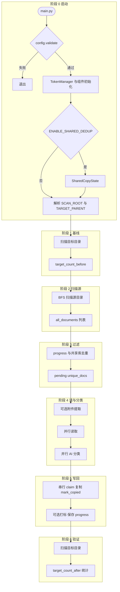
```mermaid
flowchart TB
    subgraph P0["阶段 0 启动"]
        A0([main.py]) --> A1{config.validate}
        A1 -->|失败| A1E[退出]
        A1 -->|通过| A2[TokenManager 与组件初始化]
        A2 --> A3{ENABLE_SHARED_DEDUP}
        A3 -->|是| A4[SharedCopyState]
        A3 -->|否| A5
        A4 --> A5[解析 SCAN_ROOT 与 TARGET_PARENT]
    end

    subgraph P1["阶段 1 基线"]
        B1[扫描目标目录] --> B2[target_count_before]
    end

    subgraph P2["阶段 2 扫描源"]
        C1[BFS 扫描源目录] --> C2[all_documents 列表]
    end

    subgraph P3["阶段 3 过滤"]
        D1[progress 与共享库去重] --> D2[pending unique_docs]
    end

    subgraph P4["阶段 4 读与分类"]
        D2A[可选附件提取] --> E1[并行读取]
        E1 --> E2[并行 AI 分类]
    end

    subgraph P5["阶段 5 写回"]
        F1[串行 claim 复制 mark_copied] --> F2[可选打标 保存 progress]
    end

    subgraph P6["阶段 6 验证"]
        G1[扫描目标目录] --> G2[target_count_after 统计]
    end

    A5 --> B1
    B2 --> C1
    C2 --> D1
    D2 --> D2A
    E2 --> F1
    F2 --> G1
```

---

### A.2 阶段 0：启动与初始化

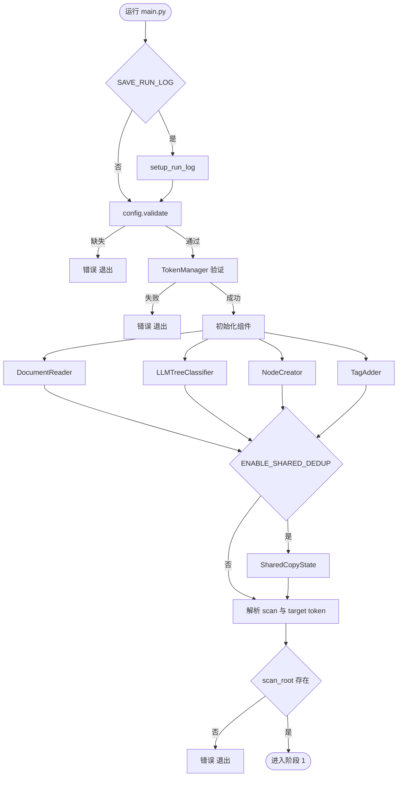
```mermaid
flowchart TD
    S0([运行 main.py]) --> S1{SAVE_RUN_LOG}
    S1 -->|是| S2[setup_run_log]
    S1 -->|否| S3
    S2 --> S3[config.validate]
    S3 -->|缺失| S3E[错误 退出]
    S3 -->|通过| S4[TokenManager 验证]

    S4 -->|失败| S4E[错误 退出]
    S4 -->|成功| S5[初始化组件]
    S5 --> S5A[DocumentReader]
    S5 --> S5B[LLMTreeClassifier]
    S5 --> S5C[NodeCreator]
    S5 --> S5D[TagAdder]

    S5A --> S6{ENABLE_SHARED_DEDUP}
    S5B --> S6
    S5C --> S6
    S5D --> S6
    S6 -->|是| S7[SharedCopyState]
    S6 -->|否| S8
    S7 --> S8[解析 scan 与 target token]
    S8 --> S8A{scan_root 存在}
    S8A -->|否| S8E[错误 退出]
    S8A -->|是| S9([进入阶段 1])
```

---

### A.3 阶段 1 和 2：目标基线 + 源目录扫描

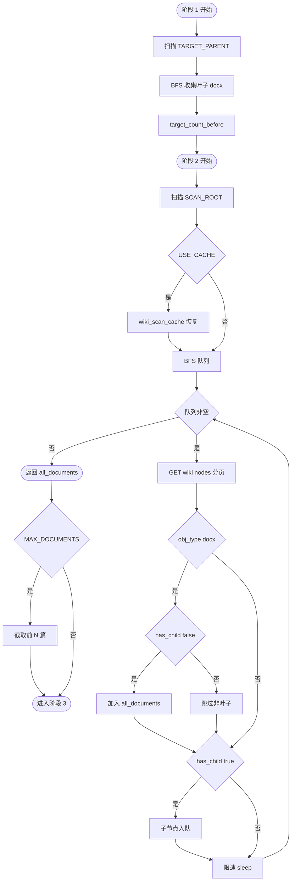
```mermaid
flowchart TD
    T0([阶段 1 开始]) --> T1[扫描 TARGET_PARENT]
    T1 --> T2[BFS 收集叶子 docx]
    T2 --> T3[target_count_before]

    T3 --> T4([阶段 2 开始])
    T4 --> T5[扫描 SCAN_ROOT]
    T5 --> T6{USE_CACHE}
    T6 -->|是| T7[wiki_scan_cache 恢复]
    T6 -->|否| T8
    T7 --> T8[BFS 队列]

    T8 --> T9{队列非空}
    T9 -->|否| T9D([返回 all_documents])
    T9 -->|是| T10[GET wiki nodes 分页]

    T10 --> T11{obj_type docx}
    T11 -->|是| T12{has_child false}
    T11 -->|否| T14
    T12 -->|是| T13[加入 all_documents]
    T12 -->|否| T12S[跳过非叶子]
    T13 --> T14
    T12S --> T14

    T14{has_child true}
    T14 -->|是| T15[子节点入队]
    T14 -->|否| T16[限速 sleep]
    T15 --> T16
    T16 --> T9

    T9D --> T17{MAX_DOCUMENTS}
    T17 -->|是| T18[截取前 N 篇]
    T17 -->|否| T19([进入阶段 3])
    T18 --> T19
```

---

### A.4 阶段 3：过滤、断点续跑与去重

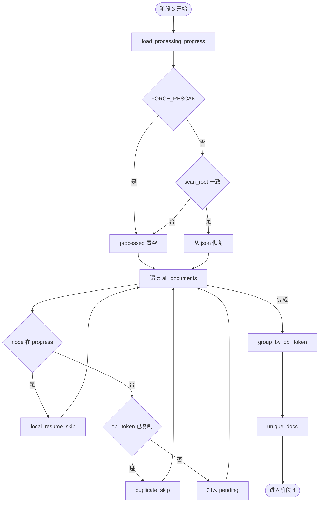
```mermaid
flowchart TD
    F0([阶段 3 开始]) --> F1[load_processing_progress]
    F1 --> F2{FORCE_RESCAN}
    F2 -->|是| F3[processed 置空]
    F2 -->|否| F4{scan_root 一致}
    F4 -->|否| F3
    F4 -->|是| F5[从 json 恢复]

    F3 --> F6[遍历 all_documents]
    F5 --> F6

    F6 --> F7{node 在 progress}
    F7 -->|是| F7S[local_resume_skip]
    F7 -->|否| F8{obj_token 已复制}
    F8 -->|是| F8S[duplicate_skip]
    F8 -->|否| F9[加入 pending]

    F7S --> F6
    F8S --> F6
    F9 --> F6

    F6 -->|完成| F10[group_by_obj_token]
    F10 --> F11[unique_docs]
    F11 --> F12N([进入阶段 4])
```

---

### A.5 阶段 4a：附件提取（可选）

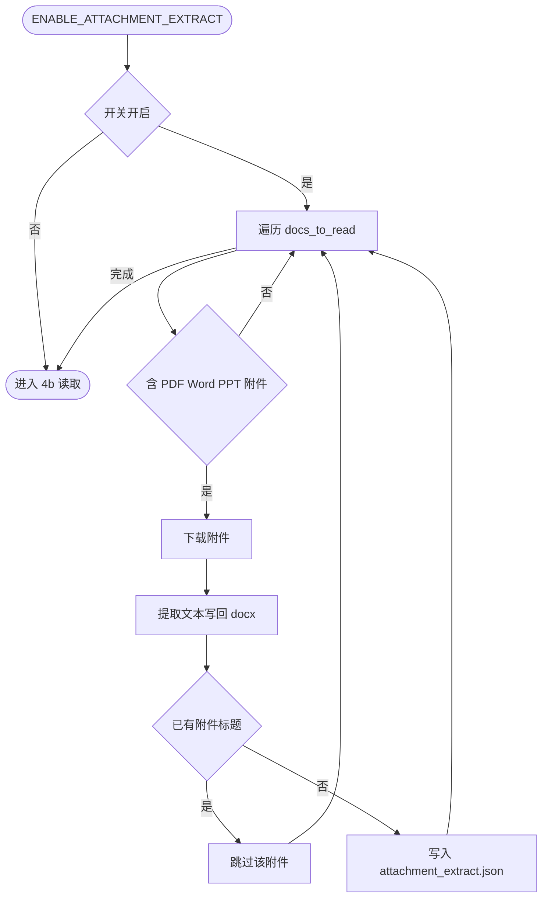
```mermaid
flowchart TD
    A0([ENABLE_ATTACHMENT_EXTRACT]) --> A1{开关开启}
    A1 -->|否| A9([进入 4b 读取])
    A1 -->|是| A2[遍历 docs_to_read]
    A2 --> A3{含 PDF Word PPT 附件}
    A3 -->|否| A2
    A3 -->|是| A4[下载附件]
    A4 --> A5[提取文本写回 docx]
    A5 --> A6{已有附件标题}
    A6 -->|是| A7[跳过该附件]
    A6 -->|否| A8[写入 attachment_extract.json]
    A7 --> A2
    A8 --> A2
    A2 -->|完成| A9
```

---

### A.6 阶段 4b：并行读取正文

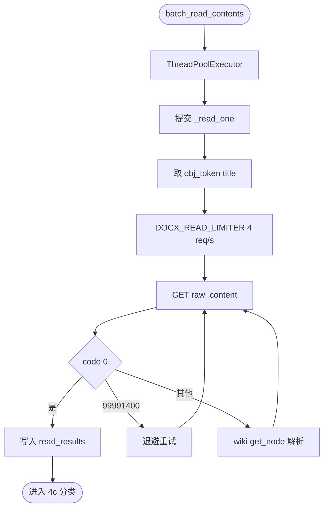
```mermaid
flowchart TD
    R0([batch_read_contents]) --> R1[ThreadPoolExecutor]
    R1 --> R2[提交 _read_one]
    R2 --> R3[取 obj_token title]
    R3 --> R4[DOCX_READ_LIMITER 4 req/s]
    R4 --> R5[GET raw_content]
    R5 --> R6{code 0}
    R6 -->|是| R7[写入 read_results]
    R6 -->|99991400| R8[退避重试]
    R8 --> R5
    R6 -->|其他| R9[wiki get_node 解析]
    R9 --> R5
    R7 --> R10([进入 4c 分类])
```

---

### A.7 阶段 4c：并行 AI 分类

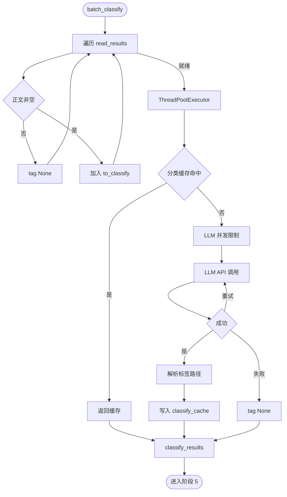
```mermaid
flowchart TD
    C0([batch_classify]) --> C1[遍历 read_results]
    C1 --> C2{正文非空}
    C2 -->|否| C2S[tag None]
    C2 -->|是| C3[加入 to_classify]
    C2S --> C1
    C3 --> C1
    C1 -->|就绪| C4[ThreadPoolExecutor]
    C4 --> C5{分类缓存命中}
    C5 -->|是| C5H[返回缓存]
    C5 -->|否| C6[LLM 并发限制]
    C6 --> C7[LLM API 调用]
    C7 --> C8{成功}
    C8 -->|重试| C7
    C8 -->|是| C11[解析标签路径]
    C8 -->|失败| C9F[tag None]
    C11 --> C14[写入 classify_cache]
    C5H --> C20[classify_results]
    C14 --> C20
    C9F --> C20
    C20 --> C21([进入阶段 5])
```

---

### A.8 阶段 5：串行复制与打标

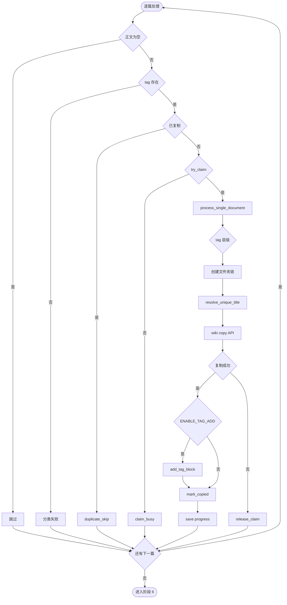
```mermaid
flowchart TD
    P0([逐篇处理]) --> P1{正文为空}
    P1 -->|是| P1S[跳过]
    P1 -->|否| P2{tag 存在}
    P2 -->|否| P2F[分类失败]
    P2 -->|是| P3{已复制}
    P3 -->|是| P3S[duplicate_skip]
    P3 -->|否| P4{try_claim}

    P4 -->|否| P4S[claim_busy]
    P4 -->|是| P5[process_single_document]
    P5 --> P6{tag 层级}
    P6 --> P7[创建文件夹链]
    P7 --> P8[resolve_unique_title]
    P8 --> P9[wiki copy API]
    P9 --> P10{复制成功}
    P10 -->|是| P11{ENABLE_TAG_ADD}
    P11 -->|是| P12[add_tag_block]
    P11 -->|否| P13
    P12 --> P13[mark_copied]
    P10 -->|否| P10F[release_claim]
    P13 --> P14[save progress]
    P10F --> P15
    P2F --> P15
    P1S --> P15
    P3S --> P15
    P4S --> P15
    P14 --> P15{还有下一篇}
    P15 -->|是| P0
    P15 -->|否| P19([进入阶段 6])
```

---

### A.9 阶段 6：验证统计与输出

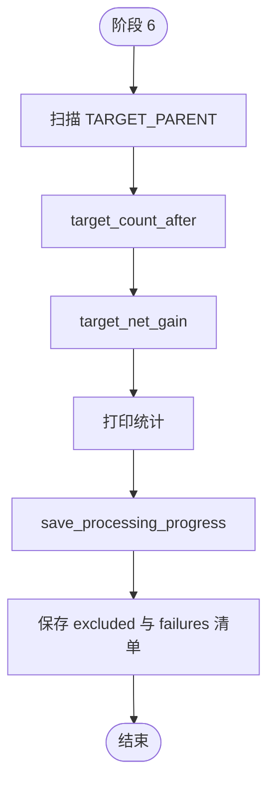
```mermaid
flowchart TD
    V0([阶段 6]) --> V1[扫描 TARGET_PARENT]
    V1 --> V2[target_count_after]
    V2 --> V3[target_net_gain]
    V3 --> V4[打印统计]
    V4 --> V5[save_processing_progress]
    V5 --> V6[保存 excluded 与 failures 清单]
    V6 --> V7([结束])
```

---

### A.10 多人并行协调（SharedCopyState）

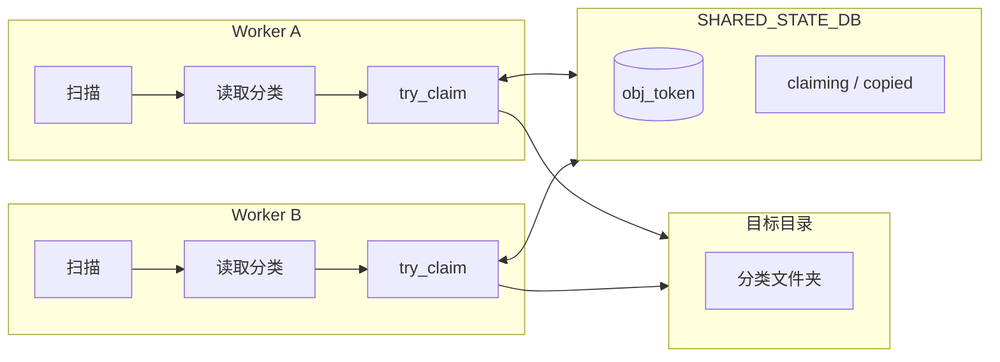
```mermaid
flowchart LR
    subgraph W1["Worker A"]
        A1[扫描] --> A2[读取分类]
        A2 --> A3[try_claim]
    end

    subgraph W2["Worker B"]
        B1[扫描] --> B2[读取分类]
        B2 --> B3[try_claim]
    end

    subgraph DB["SHARED_STATE_DB"]
        D1[(obj_token)]
        D2[claiming / copied]
    end

    subgraph TARGET["目标目录"]
        T1[分类文件夹]
    end

    A3 <--> DB
    B3 <--> DB
    A3 --> TARGET
    B3 --> TARGET
```

**协调规则：**

- 同一 `obj_token` 只允许一条 `copied` 记录
- `try_claim` 失败 → 其他 worker 正在处理，本 worker 跳过
- `claiming` 超时（默认 30 分钟）→ 自动清理，允许重新抢占
- 网络共享盘使用 `DELETE` 日志模式，损坏时自动重建

---

### A.11 持久化与缓存数据流

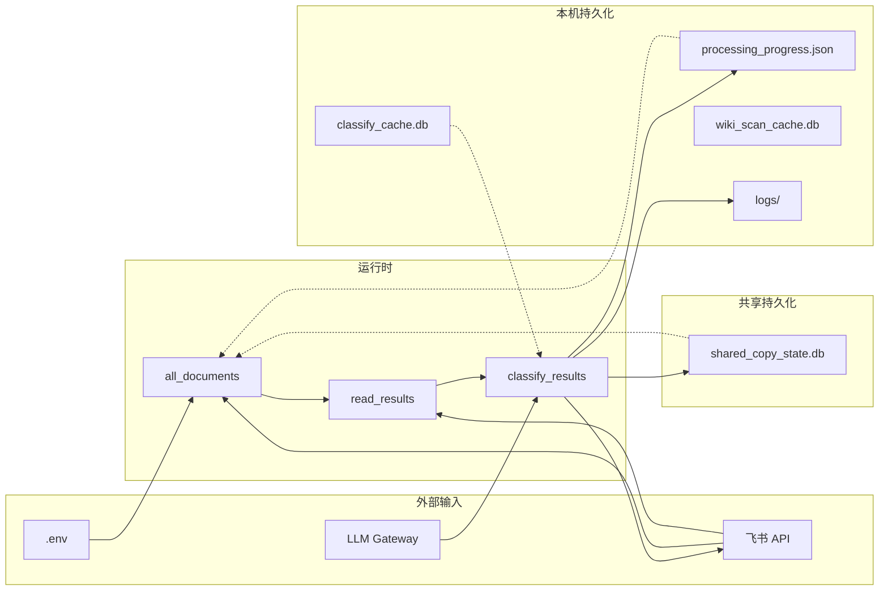
```mermaid
flowchart LR
    subgraph INPUT["外部输入"]
        ENV[".env"]
        FEISHU["飞书 API"]
        LLM["LLM Gateway"]
    end

    subgraph RUNTIME["运行时"]
        DOCS["all_documents"]
        READ["read_results"]
        TAGS["classify_results"]
    end

    subgraph LOCAL["本机持久化"]
        PP["processing_progress.json"]
        CC["classify_cache.db"]
        WC["wiki_scan_cache.db"]
        LOG["logs/"]
    end

    subgraph SHARED["共享持久化"]
        SS["shared_copy_state.db"]
    end

    ENV --> DOCS
    FEISHU --> DOCS
    PP -.-> DOCS
    SS -.-> DOCS
    DOCS --> READ
    FEISHU --> READ
    READ --> TAGS
    CC -.-> TAGS
    LLM --> TAGS
    TAGS --> FEISHU
    TAGS --> PP
    TAGS --> SS
    TAGS --> LOG
```

---

*文档对应仓库：AI_DocClassifier · 分支 feature/scan-folders-batch*
