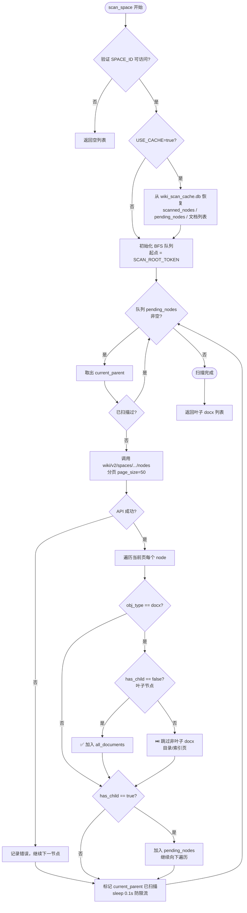
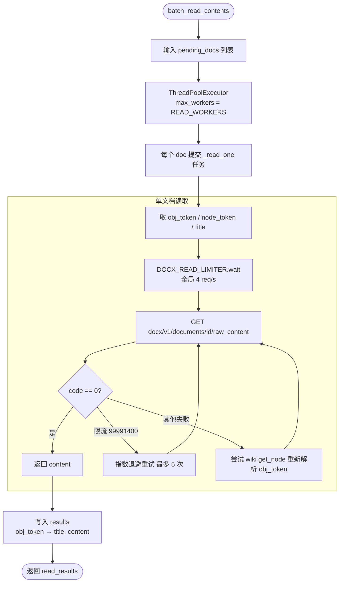
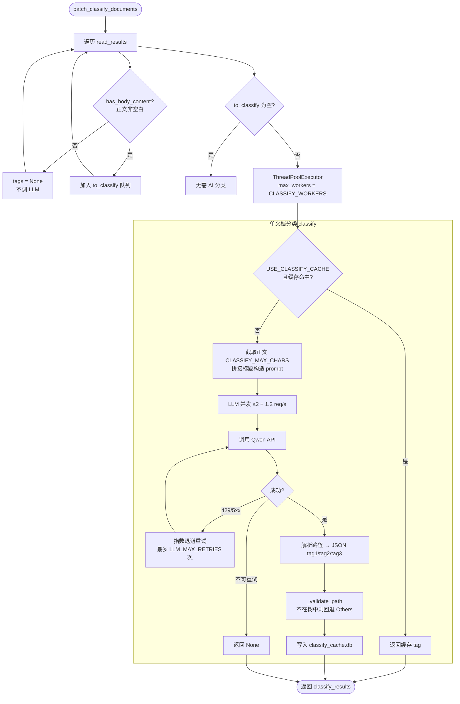
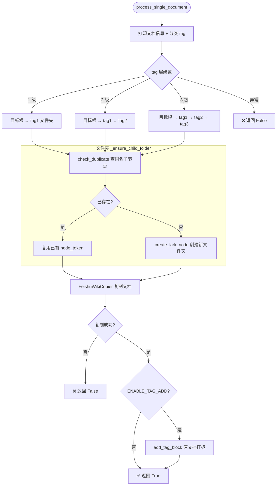
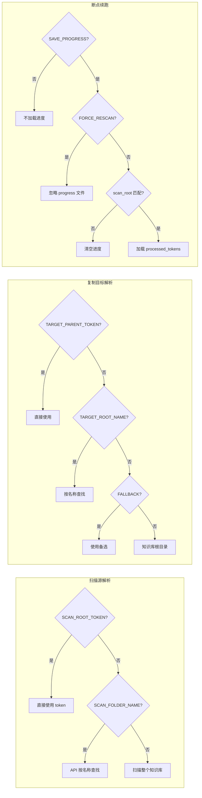
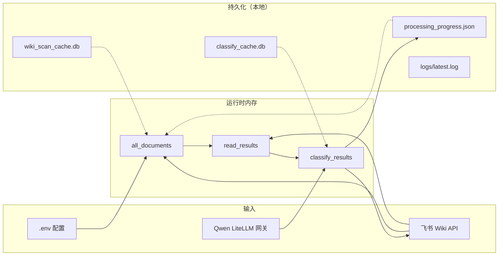
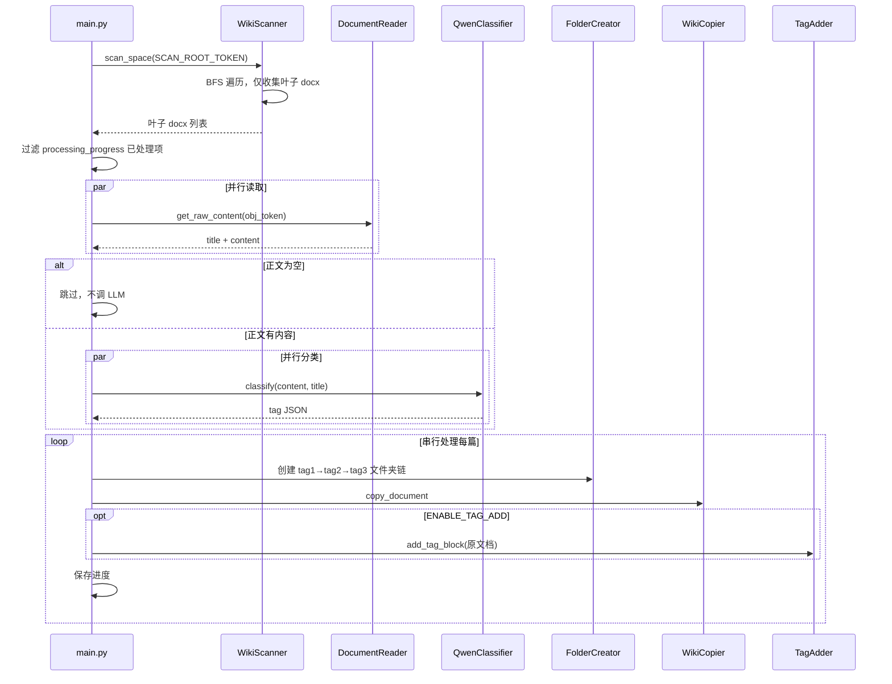
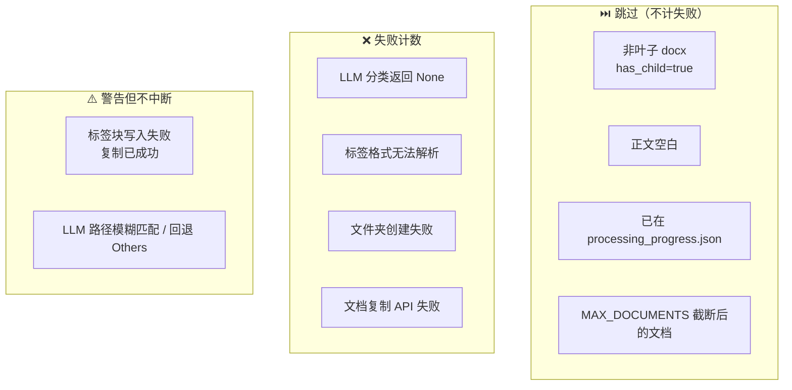

# AI DocClassifier 系统说明文档

> 飞书知识库文档自动分类系统 — 机制说明、配置参数与流程图  
> 整理日期：2026-06-12

---

## 目录

1. [系统目标](#一系统目标)
2. [整体架构](#二整体架构)
3. [运行流程（7 步）](#三运行流程7-步)
4. [分类机制](#四分类机制)
5. [配置参数说明](#五配置参数说明)
6. [运行时生成的文件](#六运行时生成的文件)
7. [常见运维场景](#七常见运维场景)
8. [并发模型总结](#八并发模型总结)
9. [流程框图](#九流程框图)
10. [附录：跳过/失败分支汇总](#十附录跳过失败分支汇总)

---

## 一、系统目标

本系统用于**自动整理飞书知识库文档**：

1. 在指定源目录下扫描**叶子 docx 文档**（`has_child=false`）
2. 读取正文，调用 **Qwen LLM** 按预定义标签树分类
3. 在目标目录下按分类结果**创建文件夹层级并复制文档**
4. 可选：在**原文档**中插入分类标签块

整体采用「**扫描 → 批量读 → 批量分类 → 串行写回**」的流水线架构。

---

## 二、整体架构

| 模块 | 文件 | 职责 |
|------|------|------|
| 入口编排 | `main.py` | 流程控制、并行调度、进度统计 |
| 配置 | `config.py` | 从 `.env` 加载环境变量 |
| Token | `token_manager.py` | 飞书 `tenant_access_token` 自动刷新（默认 30 分钟） |
| 扫描 | `wiki_scanner.py` | BFS 遍历 wiki 节点树，只收集叶子 docx |
| 读文档 | `read_feishu_doc.py` | 调用 docx API 获取 raw_content |
| 分类 | `qwen_classifier.py` | 标签树 + Qwen API 分类 |
| 分类缓存 | `classify_cache.py` | SQLite 缓存分类结果 |
| 文件夹 | `create_feishu_node.py` / `feishu_title_check.py` | 创建/查找目标文件夹 |
| 复制 | `copy_doc.py` | 将文档复制到目标文件夹 |
| 打标 | `add_tag_block.py` | 在原文档插入标签块 |
| 限流 | `feishu_rate_limit.py` / `llm_rate_limit.py` | 飞书读文档 & LLM 调用限速 |
| 日志 | `run_logging.py` | 终端输出同步写入 `logs/` |

---

## 三、运行流程（7 步）

### 步骤 1：配置校验与 Token 初始化

- 启动时执行 `config.validate()`，检查必填项
- 创建 `TokenManager`，向飞书申请 `tenant_access_token`
- 后续所有飞书 API 调用统一通过 `token_manager.get_token()` 取 token

### 步骤 2：组件初始化

- `FeishuDocumentReader`：读文档正文
- `QwenTreeClassifier`：LLM 分类器（内置标签树 `LABEL_TREE`）
- `ClassifyCache`：可选，SQLite 分类结果缓存
- `FeishuNodeCreator` / `FolderNameChecker`：目标目录管理
- `FeishuDocumentTagAdder`：原文档打标

### 步骤 3：确定扫描源与复制目标

**扫描源（二选一）：**

- `SCAN_ROOT_TOKEN`：直接指定 wiki 节点 token
- `SCAN_FOLDER_NAME`：按文件夹名称在知识库根层查找

**复制目标（优先级递减）：**

1. `TARGET_PARENT_TOKEN`
2. `TARGET_ROOT_NAME`（按名称查找）
3. `FALLBACK_PARENT_TOKEN`（备选）
4. 都找不到 → 使用知识库根目录

### 步骤 4：扫描叶子文档（`wiki_scanner.py`）

采用 **BFS（广度优先）** 遍历 wiki 节点树：

```
扫描根节点
  └─ 获取子节点列表（分页，每页 50）
       ├─ 若 obj_type == "docx" 且 has_child == false → 加入待处理列表（叶子文档）
       ├─ 若 has_child == true → 加入待扫描队列（继续向下）
       └─ 非 docx 但有子节点 → 仅遍历，不收集
```

**关键过滤规则：**

| 类型 | 处理方式 |
|------|----------|
| 叶子 docx（`has_child=false`） | ✅ 收集，进入后续流程 |
| 非叶子 docx（目录/索引页，有子节点） | ❌ 跳过，不读、不分类 |
| 正文为空的叶子 docx | ⏭️ 读取后跳过，不调 LLM |
| 已在 `processing_progress.json` 中的 node | ⏭️ 跳过（断点续跑） |

**扫描缓存**（`USE_CACHE=true` 时）：

- SQLite：`wiki_scan_cache.db`（节点缓存 + 扫描进度）
- JSON：`scanned_documents_{cache_key}.json`
- 缓存 key 带 `_leaf` 后缀，与旧版全量扫描区分

### 步骤 5：加载处理进度

- 读取 `processing_progress.json` 中已成功的 `node_token` 集合
- 若 `FORCE_RESCAN=true` → 忽略进度，全部重跑
- 若 `scan_root` 与当前 `SCAN_ROOT_TOKEN` 不一致 → 清空进度

### 步骤 6：批量读取 + 并行分类

**6a. 并行读取（`READ_WORKERS` 线程）**

- 调用飞书 `docx/v1/documents/{id}/raw_content` 获取纯文本
- 全局限速：`DOCX_READ_LIMITER` = **4 次/秒**（飞书上限 5 次/秒）
- 遇限流错误 `99991400` 自动重试（最多 5 次）

**6b. 并行 AI 分类（`CLASSIFY_WORKERS` 线程）**

- 正文为空 → 直接跳过，不调 LLM
- 有正文 → 构造 prompt（标题 + 正文前 `CLASSIFY_MAX_CHARS` 字符）
- LLM 返回标签路径，如 `Cellular -> 固件升级`
- 转换为 JSON：`{"tag1": ["Cellular"], "tag2": ["固件升级"]}`
- 路径校验：必须在预定义 `LABEL_TREE` 中，否则回退为 `Others`
- 分类缓存：同一 `obj_token` + 相同内容 hash → 直接命中缓存，不调 LLM

**LLM 调用保护：**

- 并发上限：2（`LLM_CONCURRENCY`）
- 速率：1.2 次/秒（`LLM_RATE_LIMITER`）
- 失败重试：最多 `LLM_MAX_RETRIES` 次，指数退避

### 步骤 7：串行复制 + 打标

对每个分类成功的文档**串行**执行（避免飞书写操作冲突）：

1. 根据 tag 层级（1～3 级）在目标目录下**查找或创建**文件夹链  
   例：`Smart → BSP → I2C/UART/SPI/CAN`
2. 调用 wiki copy API 将文档复制到最深层文件夹
3. 若 `ENABLE_TAG_ADD=true`，在**原文档**插入分类标签块

每处理 5 个文档自动保存一次 `processing_progress.json`。

---

## 四、分类机制

### 4.1 标签树

分类依据是代码中硬编码的 `LABEL_TREE`（见 `qwen_classifier.py`），顶层标签包括：

- `Cellular`（蜂窝模组相关）
- `Automotive`（车载相关）
- `Smart`（智能设备/BSP 相关）
- 等

树最深 3 级，LLM 必须从树中选择路径，不能自由发明标签。

### 4.2 分类输出格式

```json
{"tag1": ["Smart"], "tag2": ["BSP"], "tag3": ["I2C/UART/SPI/CAN"]}
```

- 1 级标签 → 在目标根下建 1 层文件夹
- 2 级标签 → 建 2 层
- 3 级标签 → 建 3 层

### 4.3 空文档处理（三层防护）

1. **扫描层**：非叶子 docx 不进入列表
2. **分类层**：`has_body_content()` 为 false 不调 LLM
3. **分类器层**：`classify()` 内再次检查正文为空返回 `None`

---

## 五、配置参数说明

所有配置通过项目根目录的 **`.env`** 文件设置，由 `config.py` 加载。

### 5.1 必填参数

| 参数 | 类型 | 说明 | 示例 |
|------|------|------|------|
| `FEISHU_APP_ID` | 字符串 | 飞书开放平台应用 App ID | `cli_xxxxxxxx` |
| `FEISHU_APP_SECRET` | 字符串 | 飞书应用 App Secret | `xxxxxxxx` |
| `SPACE_ID` | 字符串 | 知识库空间 ID | `7595802147485141976` |
| `QWEN_API_KEY` | 字符串 | 通义千问 / LiteLLM 网关 API Key | `sk-xxxxxxxx` |
| `SCAN_ROOT_TOKEN` | 字符串 | 扫描源目录的 wiki node token | 与 `SCAN_FOLDER_NAME` 二选一 |
| `SCAN_FOLDER_NAME` | 字符串 | 扫描源目录名称（在知识库根层查找） | 与 `SCAN_ROOT_TOKEN` 二选一 |
| `TARGET_PARENT_TOKEN` | 字符串 | 复制目标根目录 token | 与 `TARGET_ROOT_NAME` 二选一 |
| `TARGET_ROOT_NAME` | 字符串 | 复制目标根目录名称 | 与 `TARGET_PARENT_TOKEN` 二选一 |

### 5.2 可选参数 — 目录与行为

| 参数 | 默认值 | 说明 |
|------|--------|------|
| `FALLBACK_PARENT_TOKEN` | 无 | 目标目录查找失败时的备选 token/名称 |
| `USE_CACHE` | `false` | 是否启用 wiki 扫描 SQLite 缓存（`wiki_scan_cache.db`），中断后可恢复扫描进度 |
| `MAX_DOCUMENTS` | `0`（无限制） | 测试用：只处理前 N 个文档 |
| `ENABLE_TAG_ADD` | `true` | 复制成功后是否在原文档插入分类标签块 |
| `SAVE_PROGRESS` | `true` | 是否保存处理进度到 `processing_progress.json` |
| `FORCE_RESCAN` | `false` | 设为 `true` 时忽略进度文件，重新处理所有文档 |
| `SAVE_RUN_LOG` | `true` | 是否将终端输出同步写入日志文件 |
| `LOG_DIR` | `logs` | 日志目录，生成 `latest.log` 和带时间戳的归档日志 |

### 5.3 可选参数 — 性能调优

| 参数 | 默认值 | 说明 |
|------|--------|------|
| `READ_WORKERS` | `3` | 并行读取文档的线程数。过高易触发飞书限流（HTTP 400, code `99991400`），建议 2～3 |
| `CLASSIFY_WORKERS` | `4` | 并行 AI 分类的线程数。实际 LLM 并发被全局限制为 2，过高无益 |
| `CLASSIFY_MAX_CHARS` | `3000` | 送入 LLM 的正文最大字符数（标题另附） |
| `USE_CLASSIFY_CACHE` | `true` | 是否启用分类结果 SQLite 缓存（`classify_cache.db`）。内容变更后 hash 不同会自动重分类 |
| `CLASSIFY_VERBOSE` | `false` | 设为 `true` 时打印 LLM 原始返回和缓存命中详情 |
| `LLM_MAX_RETRIES` | `6` | LLM 调用失败时的最大重试次数（429/5xx 等可重试错误） |
| `LLM_REQUEST_TIMEOUT` | `120` | 单次 LLM 请求超时（秒） |
| `PROGRESS_INTERVAL` | `10` | 批量读取/分类时每处理 N 个文档打印一次进度 |

### 5.4 布尔值写法

以下值均视为 `true`：`1`、`true`、`yes`、`on`（不区分大小写）。  
未设置或非上述值时使用默认值。

### 5.5 配置示例

```env
FEISHU_APP_ID=cli_xxxxxxxx
FEISHU_APP_SECRET=xxxxxxxx
SPACE_ID=7595802147485141976
SCAN_ROOT_TOKEN=JUWxwwvfJiLWQvk9HLHc3b24nie
TARGET_PARENT_TOKEN=GPFewOUJ1iGBrGks7R7cB137nDh
QWEN_API_KEY=sk-xxxxxxxx

# 可选调优
READ_WORKERS=3
CLASSIFY_WORKERS=4
USE_CLASSIFY_CACHE=true
SAVE_PROGRESS=true
```

### 5.6 同事如何生成本地 `.env`

1. 克隆项目后，在项目根目录执行：

    ```powershell
    copy .env.example .env
    ```

2. 用编辑器打开 `.env`，填入真实值（**不要**提交到 Git）
3. 验证配置：

    ```powershell
    .venv\Scripts\python.exe -c "import config; config.validate(); print('OK')"
    ```

4. 密钥/token 通过团队文档或私下传递，不要写入 `.env.example`

---

## 六、运行时生成的文件

| 文件 | 触发条件 | 用途 |
|------|----------|------|
| `processing_progress.json` | `SAVE_PROGRESS=true` | 已成功处理的 node_token，断点续跑 |
| `classify_cache.db` | `USE_CLASSIFY_CACHE=true` | AI 分类结果缓存 |
| `wiki_scan_cache.db` | `USE_CACHE=true` | wiki 节点扫描缓存 |
| `scanned_documents_*.json` | `USE_CACHE=true` | 扫描到的文档列表快照 |
| `logs/latest.log` | `SAVE_RUN_LOG=true` | 实时日志 |
| `logs/run_YYYYMMDD_HHMMSS.log` | `SAVE_RUN_LOG=true` | 单次运行归档日志 |

以上文件均在 `.gitignore` 中，不会提交到 Git。

---

## 七、常见运维场景

| 场景 | 操作 |
|------|------|
| 中断后续跑 | 直接重新运行 `main.py`，读取 `processing_progress.json` 跳过已完成项 |
| 全部重跑 | 删除 `processing_progress.json`，或设 `FORCE_RESCAN=true` |
| 换扫描目录 | 修改 `SCAN_ROOT_TOKEN`，进度文件会因 `scan_root` 不匹配自动清空 |
| 强制重新分类 | 设 `USE_CLASSIFY_CACHE=false`，或删除 `classify_cache.db` |
| 飞书限流 | 降低 `READ_WORKERS` 到 2 |
| LLM 502/503 | 降低 `CLASSIFY_WORKERS`，或调整 `llm_rate_limit.py` 中的并发/QPS |
| 测试小批量 | 设 `MAX_DOCUMENTS=10` |
| 中断程序 | 终端 `Ctrl+C`，或在任务管理器中结束 `python.exe main.py` 进程 |

---

## 八、并发模型总结

```
扫描阶段     → 单线程 BFS + 分页 API
读取阶段     → READ_WORKERS 并行，全局 4 req/s 限速
分类阶段     → CLASSIFY_WORKERS 并行，实际 LLM 并发 ≤ 2，1.2 req/s
复制/打标阶段 → 严格串行（避免飞书 wiki 写冲突）
```

读和算阶段最大化吞吐，写阶段保证飞书 API 操作稳定性。

---

## 九、流程框图

> 以下框图使用 Mermaid 语法，可在 VS Code、GitHub、Typora 等支持 Mermaid 的编辑器中渲染。

### 9.1 系统总览（启动 → 结束）

```mermaid
flowchart TB
    subgraph INIT["阶段 0：启动与初始化"]
        A0([运行 main.py]) --> A1{config.validate<br/>必填项齐全?}
        A1 -->|否| A1E[❌ 打印配置错误并退出]
        A1 -->|是| A2{SAVE_RUN_LOG?}
        A2 -->|是| A3[setup_run_log<br/>终端输出 → logs/]
        A2 -->|否| A4
        A3 --> A4[TokenManager 获取 tenant_access_token<br/>每 30 分钟自动刷新]
        A4 --> A5[初始化组件<br/>Reader / Classifier / Creator / Checker / TagAdder]
    end

    subgraph RESOLVE["阶段 1：解析目录"]
        B1[解析扫描源<br/>SCAN_ROOT_TOKEN 或 SCAN_FOLDER_NAME]
        B2[解析复制目标<br/>TARGET_PARENT_TOKEN / TARGET_ROOT_NAME / FALLBACK]
        B1 --> B3{scan_root_token 存在?}
        B3 -->|否| B3E[❌ 退出]
        B3 -->|是| B4[target_root_token<br/>未找到则用知识库根]
    end

    subgraph SCAN["阶段 2：扫描"]
        C1[SimpleWikiScanner BFS 遍历<br/>仅收集叶子 docx]
        C1 --> C2{MAX_DOCUMENTS > 0?}
        C2 -->|是| C3[截取前 N 篇]
        C2 -->|否| C4[扫描结果就绪]
        C3 --> C4
    end

    subgraph PROGRESS["阶段 3：断点"]
        D1[load_processing_progress]
        D1 --> D2{FORCE_RESCAN<br/>或 scan_root 变更?}
        D2 -->|是| D3[processed_tokens = 空集]
        D2 -->|否| D4[从 processing_progress.json 恢复]
        D3 --> D5[过滤 pending_docs<br/>排除已处理 node_token]
        D4 --> D5
    end

    subgraph BATCH["阶段 4：批量读 + 分类"]
        E1[ThreadPool 并行读取<br/>READ_WORKERS + 飞书 4 req/s 限速]
        E2[ThreadPool 并行分类<br/>CLASSIFY_WORKERS + LLM 并发≤2]
        E1 --> E2
    end

    subgraph SERIAL["阶段 5：串行写回"]
        F1[逐篇遍历 read_results]
        F2{正文为空?}
        F3{分类成功?}
        F4[创建文件夹链 + 复制 + 可选打标]
        F1 --> F2
        F2 -->|是| F2S[⏭️ 跳过]
        F2 -->|否| F3
        F3 -->|否| F3F[❌ 失败计数]
        F3 -->|是| F4
        F4 --> F5{复制成功?}
        F5 -->|是| F6[写入 processed_tokens<br/>每 5 篇保存进度]
        F5 -->|否| F3F
    end

    subgraph FINISH["阶段 6：收尾"]
        G1[打印统计信息]
        G2[save_processing_progress 最终保存]
        G3([结束])
        G1 --> G2 --> G3
    end

    A5 --> B1
    B4 --> C1
    C4 --> D1
    D5 --> E1
    E2 --> F1
    F6 --> G1
```



### 9.2 Wiki 扫描阶段（叶子节点过滤）



### 9.3 并行读取阶段



### 9.4 并行 AI 分类阶段



### 9.5 串行复制与打标阶段



### 9.6 配置解析与断点续跑决策



### 9.7 数据流与缓存层



### 9.8 单篇文档端到端时序



---

## 十、附录：跳过/失败分支汇总



---

## 快速启动

```powershell
# 1. 环境准备
python -m venv .venv
.venv\Scripts\python.exe -m pip install -r requirements.txt
copy .env.example .env
# 编辑 .env 填入配置

# 2. 验证配置
.venv\Scripts\python.exe -c "import config; config.validate(); print('OK')"

# 3. 运行
.venv\Scripts\python.exe main.py
```

---

*文档对应代码仓库：AI_DocClassifier（master 分支，含叶子节点扫描逻辑）*
