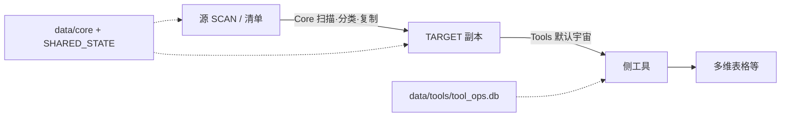

# 架构说明：Core（主流程）与 Tools（侧工具）

> 对应分支：`feature/arch-data-dir-cleanup` · 更新 2026-08-12  
> 分支变更年表见 [BRANCHES.md](BRANCHES.md) · 目录树见 [PROJECT_STRUCTURE.md](PROJECT_STRUCTURE.md) · 附录流程图见 [说明文档 §附录](AI_DocClassifier说明文档.md#附录各阶段逻辑图)

本文回答：

1. **主程序和功能工具各自干什么、怎么协作**  
2. **本轮架构优化记在哪里、改了什么**  
3. **以后加新功能该怎么接**

---

## 1. 一句话关系

**Core（`main.py`）把源目录文档分类复制进 TARGET；Tools（`tools.*`）默认只处理 TARGET 里已有的副本，用独立账本 `tool_ops.db` 做按操作跳过。**

二者通过 **TARGET 目录里的叶子文档** 衔接，而不是共用 `shared_copy_state` 当工具进度。



---

## 2. Core vs Tools 对照

| | **Core（主流程）** | **Tools（侧工具）** |
|--|--|--|
| 入口 | `main.py`（控制台「主流程」） | `python -m tools.*`（「副本增强 / 文档元数据表 / 归纳新标题 / 运维纠偏」） |
| 文档宇宙 | `SCAN_*` / `scan_folders.json` **源** | 默认 **`TARGET_PARENT_TOKEN`**；`--scope scan` 可选扫源 |
| 本地状态 | `data/core/` | **唯一** `data/tools/tool_ops.db` |
| 团队共享 | `SHARED_STATE_DB` 等 UNC | 一般不写共享去重库 |
| 职责 | 扫描 → 附件提取 → 分类 → 复制 → **本次** enrichment 钩子 | 回填、元数据 bitable、**归纳新标题**、Others… |
| 扩展 | 钩子进 `enrichment/`，勿把工具业务塞进 `main.py` | `OP_*` + `ToolJob` + 控制台挂项；禁止再建 `*_index.db` |

---

## 3. 协作逻辑（详细）

### 3.1 Core 做什么

1. 按清单（或 `SCAN_ROOT_TOKEN`）BFS 源目录叶子 docx  
2. 可选：附件提取写回**源**文档  
3. 读正文 → LLM 分类  
4. `try_claim` → 复制到 TARGET 分类文件夹 → `mark_copied`（共享去重）  
5. **复制成功后立刻**跑 enrichment 钩子（贴元数据表 / 附件分隔，对象是**目标副本**）  
6. 可选：给**源**文档打分类标签块  
7. 结束时再扫一遍 TARGET 做数量校验  

Core **不**负责：汇总多维表格、归纳新标题表、对历史副本批量回填（那些是 Tools）。

### 3.2 Tools 做什么

1. `ToolJob` 解析 `TOOL_DOC_SCOPE`（默认 `target`）  
2. `list_target_leaf_docs` 得到文档宇宙（未进 TARGET 的源文档不会出现）  
3. 对每个计划中的 `op`，读 `tool_ops.db`：已 `done` 且 `--skip-existing` 则跳过  
4. 执行业务（写 bitable / 改副本正文等）  
5. `mark(op, result_ref=…)`；bitable 的 `record_id` 也落在 `result_ref`（按表作用域）  

| 工具 | op | 效果 |
|------|-----|------|
| `enrich_copied_docs` | `metadata_table` / `attachment_separator` | 回填旧副本；作者/源路径←SCAN，分类路径←TARGET |
| `export_doc_metadata_bitable` | `metadata_bitable` | 文档元数据 → 多维表格 |
| `export_display_title_bitable` | `display_title_bitable` | **归纳新标题** → 多维表格（不改 wiki 标题） |
| `rename_target_display_titles` | `display_title_rename` | 按 **主题-产品线-作者** 重命名 TARGET |
| `refresh_target_from_source` | `target_content_refresh` | 源 → TARGET 单向重拷（保留标题；旧副本进废弃夹） |

同一文档上各 op **互不影响**：例如元数据表已 done，仍可跑归纳新标题。

### 3.3 时间顺序（推荐）

```text
① 改清单 assignee / 或 --all-enabled
② 一人或多人都跑完 Core（所有 SCAN 新增进 TARGET）
③ 再跑 Tools（元数据表、归纳新标题、回填…）
```

原因：Tools 默认只看见 TARGET。Core 没跑完时，工具只能处理「已经复制进去的那一部分」。

### 3.4 和「共享去重」的关系

| 库 | 谁用 | 含义 |
|----|------|------|
| `SHARED_STATE_DB` | 仅 Core | 全局是否已**分类复制**过该 `obj_token` |
| `tool_ops.db` | 仅 Tools | 某个**侧操作**是否已对某文档做过 |

Tools **不会**因为 `shared_copy_state` 里有记录就跳过；只看自己的 ledger。Core 也**不会**读 `tool_ops`。

### 3.5 复制后钩子 vs 回填工具

| | enrichment 钩子（在 main 内） | `enrich_copied_docs`（Tools） |
|--|--|--|
| 时机 | 每篇**刚复制成功** | 事后批量 |
| 对象 | 本次新副本 | TARGET 下（默认）全部/待处理叶子 |
| 账本 | 可不写 / 或与回填共用 op 语义 | 写入 `tool_ops` |
| 分类路径 | 来自本次 `tag` | 无 tag → 用 TARGET 面包屑 `target_path` |
| 作者 / 源路径 | 源节点 + SCAN breadcrumb | 经 `SHARED_STATE_DB` 还原源节点后再取 |

强制重贴：`--force-metadata`（先删旧「文档元数据」再写）。

### 3.6 源与 TARGET：不同步，按需单向刷新

SCAN 与 TARGET 是**独立副本**，整理侧改标题/贴表不会回写源；源改正文也不会自动进枢纽。

需要跟进源变更时用 `refresh_target_from_source`（控制台「运维纠偏」）：重拷 → 保留当前 TARGET 标题 → 旧节点移入 `_已废弃_源刷新` → 更新共享库映射 → 可选 enrichment。配置：`REFRESH_TARGET_SKIP_UNCHANGED`、`REFRESH_TARGET_OBSOLETE_FOLDER`。

---

## 4. 本轮优化记录（`feature/arch-data-dir-cleanup`）

| 项 | 内容 |
|----|------|
| 背景 | 多个 `*_index.db`、导出工具样板重复、根目录 `.db` 噪声 |
| 做了 | `DATA_DIR`；索引收敛进 `tool_ops`；`ToolJob`；展示标题重命名；源→TARGET 刷新；贴表作者/双路径纠偏 |
| 没做 | 不拆 `main.py`；不搬 UNC 共享库；不做 SCAN↔TARGET 双向同步 |
| 提交 | 见分支 `git log`；文档随功能迭代 |

上一跳：`feature/tool-ops-target-scope`（工具默认 TARGET + 统一账本）。详见 [BRANCHES.md](BRANCHES.md)。

---

## 5. 本地数据落盘

```text
data/
  core/     # 主流程
  tools/    # tool_ops.db
logs/
```

`AUTO_MIGRATE_DATA_DIR=true` 可将根目录旧 `.db` 迁入 `data/`。共享盘路径继续用 env UNC。

---

## 6. 控制台任务对应

筛选栏：`全部 | 主流程 | 副本增强 | 文档元数据表 | 归纳新标题 | 运维纠偏`（分组卡片；试跑虚线样式；扫源带标签）。

| 筛选 | 归属 | 典型任务 |
|------|------|----------|
| 主流程 | Core | 增量/全量分类复制（我的文件夹 / 指定 folder / 全部 enabled） |
| 副本增强 | Tools | `enrich_copied_docs`（正式 / 试跑 / 强制重贴元数据） |
| 文档元数据表 | Tools | `export_doc_metadata_bitable`（TARGET 或 `[扫源]`） |
| **归纳新标题** | Tools | `export_display_title_bitable`（不改 wiki）/ `rename_target_display_titles`（只改 TARGET） |
| 运维纠偏 | Tools | `refresh_target_from_source` / Others 纠偏 / 主题归档 / 附件重试 |

详见 [CONSOLE.md](CONSOLE.md)。
