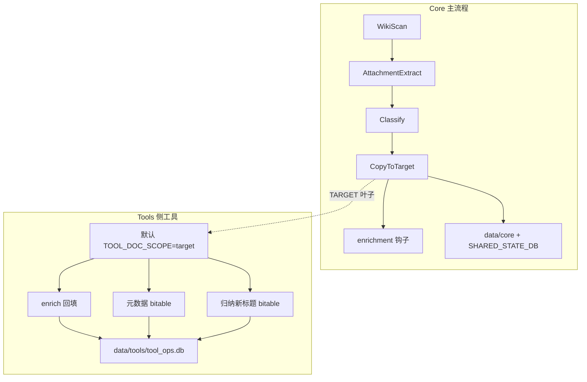

# 架构说明：Core（主流程）与 Tools（侧工具）

> 对应分支：`feature/arch-data-dir-cleanup` · 更新 2026-08-07  
> 分支变更年表见 [BRANCHES.md](BRANCHES.md) · 目录树见 [PROJECT_STRUCTURE.md](PROJECT_STRUCTURE.md)

本文回答三件事：

1. **主程序和功能工具各自干什么、状态存在哪**  
2. **本轮架构优化记在哪里、改了什么**  
3. **以后加新功能该怎么接，避免再堆索引库**

---

## 1. Core vs Tools（主程序 vs 功能工具）

| | **Core（主流程）** | **Tools（侧工具）** |
|--|--|--|
| 入口 | `main.py`（控制台「分类」任务） | `python -m tools.*`（控制台「元数据表 / 归纳新标题 / 工具」） |
| 文档宇宙 | `SCAN_*` / `scan_folders.json` **源目录** | 默认 **`TARGET_PARENT_TOKEN`**（已分类复制的叶子）；`--scope scan` 可扫源（旧行为） |
| 本地状态 | `data/core/`（快照、分类缓存、进度等） | **唯一**账本 `data/tools/tool_ops.db` |
| 团队共享 | `SHARED_STATE_DB` 等 **UNC**（不强制进个人 `data/`） | 一般不写共享去重库 |
| 职责 | 扫描 → 附件提取 → 分类 → 复制 → 复制后 enrichment 钩子 | 回填贴表/分隔符、文档元数据 bitable、**归纳新标题** bitable、Others 纠偏等 |
| 扩展 | 复制后逻辑进 `enrichment/` 插件，**不要**把工具业务塞进 `main.py` | 新工具：① `OP_*` ② `ToolJob` ③ `console/jobs.py` 挂项；**禁止**再建 `*_index.db` |



**关键约定：**

- 同一文档上，`metadata_table` / `attachment_separator` / `metadata_bitable` / `display_title_bitable` **互不影响**（各自一条 ledger 记录）。  
- 归纳新标题**只写多维表格**，**绝不改 wiki 原标题**。  
- 未复制进 TARGET 的源文档：默认**不会**被侧工具处理。

---

## 2. 本轮优化记录（`feature/arch-data-dir-cleanup`）

完整分支条目：[BRANCHES.md § arch-data-dir-cleanup](BRANCHES.md#featurearch-data-dir-cleanup数据目录--账本收敛)。

| 项 | 内容 |
|----|------|
| 背景 | 需求演进导致同类状态多份（多个 `*_index.db`）、导出工具样板重复、根目录 `.db` 噪声 |
| 做了 | ① `DATA_DIR` + `util/paths.py` 迁移提示 ② 工具索引收敛进 `tool_ops.db`（`result_ref`） ③ `tools/runner.py` ToolJob ④ 文档标明 shim / 遗留 `attachment_extractors/` |
| 明确没做 | 不拆 `main.py`；不强制搬 UNC 共享库；不上 Celery 等框架 |
| 提交 | `d19d7c1` Consolidate local runtime under data/ and unify tool ops into tool_ops.db. |

上一跳（工具只碰 TARGET + 统一账本）：`feature/tool-ops-target-scope`，见 BRANCHES 同文件上一节。

---

## 3. 本地数据落盘

```text
data/
  core/     # 主流程默认可写状态
  tools/    # tool_ops.db
logs/       # 运行与工具报告（已有）
```

- 配置：`DATA_DIR`（默认 `data`）、`AUTO_MIGRATE_DATA_DIR=true` 可将根目录旧 `.db` 迁入 `data/`。  
- 共享盘路径仍用 env 显式 UNC，**不要**塞进个人 `data/`。

---

## 4. 控制台任务对应关系

| 筛选芯片 | 逻辑归属 | 典型任务 |
|----------|----------|----------|
| 分类 | Core | `main.py --all-assigned` 等 |
| 元数据表 | Tools | `export_doc_metadata_bitable` |
| **归纳新标题** | Tools | `export_display_title_bitable` |
| 工具 | Tools | enrich 回填、Others、附件重试 |

详见 [CONSOLE.md](CONSOLE.md)。
