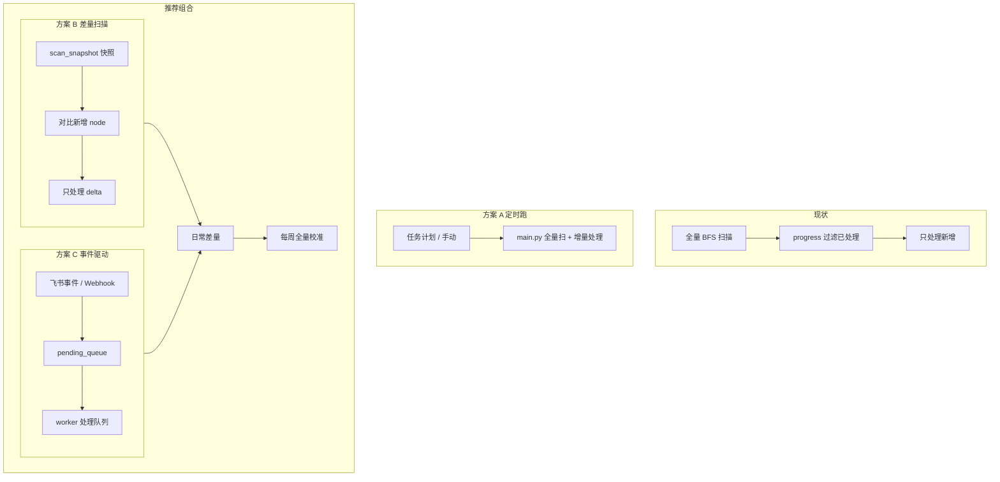
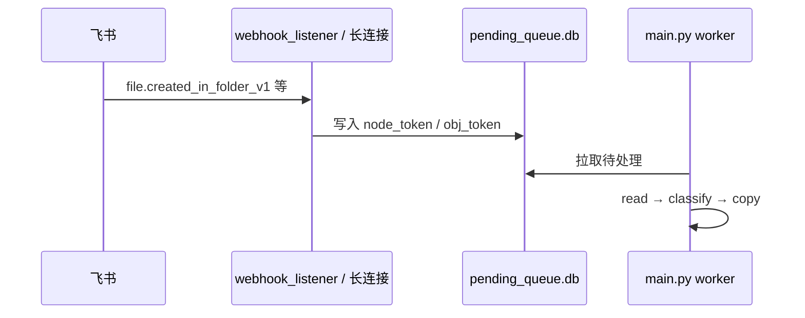
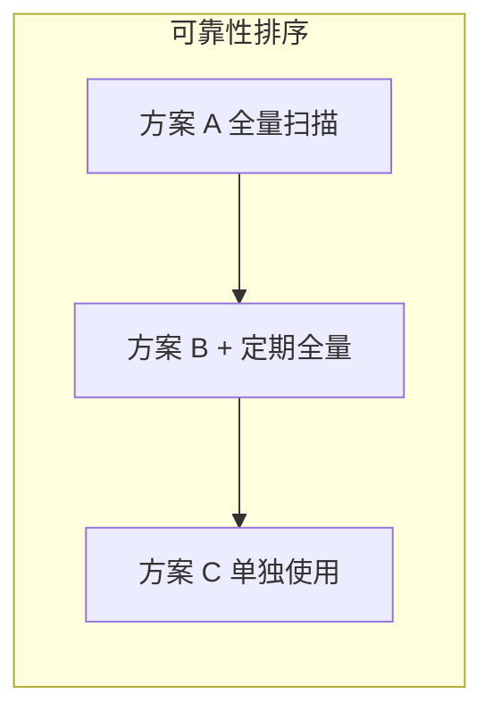

# AI DocClassifier 增量更新方案对比（内部讨论稿）

> **文档用途：** 供小组讨论「如何减少每次全量扫描的成本，同时保证新增文档不遗漏」。  
> **对应项目：** `AI_DocClassifier` · 分支 `feature/multi-worker-parallel`  
> **编写日期：** 2026-06-22  
> **已选方案：** **方案 B（扫描快照 + 增量处理）**，已落地 v1；每周全量校准见 `FULL_SCAN_CALIBRATION_DAYS`。

---

## 1. 背景与现状

### 1.1 系统在做什么

1. 在源目录 `SCAN_ROOT_TOKEN` 下 **BFS 扫描** 叶子 docx（`has_child=false`）
2. 读取正文 → LLM 分类 → 复制到 `TARGET_PARENT_TOKEN` 下按标签建的文件夹
3. 可选：多人并行 + `shared_copy_state.db` 全局去重（按 `obj_token`）

### 1.2 当前已有的「增量」能力

| 阶段 | 是否增量 | 机制 |
|------|----------|------|
| **扫描** | ❌ 全量 | 每次重新 BFS 整棵子树（1400+ 文档时，扫描可占 1～2 小时） |
| **读取 / 分类 / 复制** | ✅ 增量 | `processing_progress.json`（本机）+ `shared_copy_state.db`（多人） |

**结论：** 在 `SCAN_ROOT_TOKEN` 与 `TARGET_PARENT_TOKEN` 不变时，**新增文档不会重复分类复制**，但 **每次仍要全量扫描** 才能发现新增节点。这是目前觉得「每次跑太麻烦」的主要原因。

### 1.3 相关配置与文件

| 文件 / 配置 | 作用 |
|-------------|------|
| `processing_progress.json` | 已成功复制的源 `node_token`（本机断点） |
| `shared_copy_state.db` | 已复制的 `obj_token`（跨 worker 去重） |
| `wiki_scan_cache.db` | `USE_CACHE=true` 时扫描 BFS 断点（不减少全量扫描范围） |
| `FORCE_RESCAN=true` | 忽略本机 progress，全量重处理 |
| 定时再跑 `python main.py` | 不删 progress 即可只处理新增 |

---

## 2. 讨论目标

| 目标 | 优先级（待小组确认） |
|------|---------------------|
| 减少每次运行的扫描时间 | 高 |
| 新增文档尽快进入目标分类目录 | 中～高 |
| 不遗漏新增文档（可接受极低概率 + 定期校准） | 高 |
| 改造工作量可控 | 中 |
| 是否需要 7×24 常驻服务 | 待讨论 |

---

## 3. 方案概览



---

## 4. 方案 A：定时增量跑（零开发）

### 4.1 做法

- Windows 任务计划程序 / 手动：定期执行 `python main.py`
- **不删除** `processing_progress.json` 与共享库
- 配置保持 `SCAN_ROOT_TOKEN`、`TARGET_PARENT_TOKEN` 不变

### 4.2 优点

| 优点 | 说明 |
|------|------|
| 零开发 | 现有代码已支持处理增量 |
| 可靠 | 扫描仍全量，**发现新增的能力与现在相同** |
| 失败自动重试 | 复制/分类失败的不会写入 progress，下次会重试 |

### 4.3 缺点

| 缺点 | 说明 |
|------|------|
| 扫描仍全量 | 1400+ 篇时每次仍要数十分钟～数小时 |
| 非实时 | 取决于调度频率（如每天 1～2 次） |
| 目标目录变更 | 换 `TARGET_PARENT_TOKEN` 需 `FORCE_RESCAN` 或删 progress |

### 4.4 遗漏风险

| 风险 | 概率 |
|------|------|
| 漏发现新增文档 | **极低**（全量 BFS） |
| 漏处理（复制失败） | 低～中（有失败队列，需查 `logs/latest.log`） |

---

## 5. 方案 B：扫描快照 / 差量 BFS（需开发）

### 5.1 做法

新增 `scan_snapshot.db`（或扩展现有 `wiki_scan_cache.db`），记录：

- 上次见过的 `node_token`、`parent_token`、`obj_token`、`has_child`、`obj_type` 等

**每次运行：**

1. 对 `SCAN_ROOT` 做 BFS（或优化：跳过「子树未变」的分支）
2. 与快照对比 → 得到 **新增 / 变更** 的 node 列表
3. 仅对 **新增叶子 docx** 走 read → classify → copy
4. 更新快照

**兜底：** 每 N 天（建议 7 天）跑 1 次 **全量扫描校准**，重建或校验快照。

### 5.2 优点

| 优点 | 说明 |
|------|------|
| 扫描时间大幅下降 | 日常仅新增 5～20 篇时，扫描可从小时级降到分钟级 |
| 与现有 progress / 共享库兼容 | 处理阶段逻辑可复用 |
| 适配 wiki 节点树 | 基于 `node_token`，比云文档文件夹事件更贴近现状 |

### 5.3 缺点

| 缺点 | 说明 |
|------|------|
| 需开发 + 测试 | 快照 schema、对比逻辑、校准策略 |
| 实现不当可能漏扫 | 见下节 |
| 移入/移动节点 | 需在设计中明确是否跟踪 parent 变更 |

### 5.4 可能遗漏的场景

| 场景 | 是否可能漏 | 说明 |
|------|------------|------|
| 在已监控目录下新建叶子 docx | 一般不会 | 新 `node_token` 不在快照中 |
| 在新子文件夹下新建 | 一般不会 | 新文件夹 + 新文档都会出现 |
| 快捷方式（同 `obj_token`） | 可能漏 node，不漏实体 | 共享库按 `obj_token` 去重 |
| 非叶子 docx（目录页） | 会跳过 | 与现逻辑一致 |
| 从别处**移入** SCAN_ROOT | **可能漏** | 取决于是否跟踪移入事件 / parent 变更 |
| API 分页/限流导致某页失败 | **可能漏** | 与全量扫描相同，需失败重扫 |
| 快照损坏 | **可能漏或重复** | 需全量重建 |
| 「子树哈希未变就跳过」优化过猛 | **可能漏** | 算法需评审 + 定期全量 |

### 5.5 遗漏风险评级

**单独使用方案 B（含定期全量校准）：漏扫概率 ≈ 低**  
**无定期全量校准：漏扫概率随时间上升 ≈ 中**

---

## 6. 方案 C：飞书事件订阅 + 队列（需开发 + 运维）

### 6.1 做法



**飞书侧能力（参考）：**

- [订阅云文档事件](https://open.feishu.cn/document/uAjLw4CM/ukTMukTMukTM/reference/drive-v1/file/subscribe)
- 文件夹类型可订阅 `file.created_in_folder_v1`
- 接收方式：**Webhook（公网 URL）** 或 **长连接 WebSocket（自建应用推荐）**

**本地侧：**

- 常驻进程 `webhook_listener.py` 或飞书 SDK 长连接
- 队列 `pending_queue.db`
- `main.py --from-queue` 或独立 worker 消费队列

### 6.2 优点

| 优点 | 说明 |
|------|------|
| 近实时 | 新建后分钟级可入队 |
| 扫描压力小 | 不必为「发现新增」而全树 BFS |
| 适合「通知 + 异步处理」 | 与 LLM/复制耗时解耦 |

### 6.3 缺点

| 缺点 | 说明 |
|------|------|
| 需 7×24 服务 | Webhook 要公网；长连接要进程常在线 |
| 权限与发布 | `docs:event:subscribe`、`space:document.event:read` 等 |
| **Wiki ≠ 普通文件夹** | 知识库 `node_token` 与 drive `file_token` 需映射 |
| 长连接 3 秒内需 ack | 只能入队，不能同步分类复制 |
| 订阅边界难覆盖 | 大目录树难以对每个子文件夹都订阅 |

### 6.4 可能遗漏的场景

| 场景 | 是否可能漏 | 说明 |
|------|------------|------|
| 在**已订阅**文件夹内新建 | 一般不会 | 依赖事件推送 |
| 在**未订阅**的 wiki 子目录新建 | **会漏** | 订阅范围有限 |
| wiki 内创建但不走文件夹事件 | **会漏** | wiki 与 drive 事件不完全一致 |
| 快捷方式 / 移入知识库 | **可能漏** | 事件类型不一定覆盖 |
| 监听服务宕机期间新建 | **会漏** | 事件可能不重放 |
| 非 docx / 非叶子 | 收到但跳过 | 业务过滤，非漏扫 |

### 6.5 遗漏风险评级

**单独使用方案 C：漏扫概率 ≈ 中～高**  
**必须配合方案 B 或定期全量扫描兜底**

---

## 7. 三方案对比总表

| 维度 | 现状 / 方案 A | 方案 B 差量扫描 | 方案 C 事件 + 队列 |
|------|---------------|-----------------|-------------------|
| **开发量** | 无 | 中 | 中～高 |
| **运维** | 低（定时跑脚本） | 低 | 高（常驻服务、公网/长连接） |
| **扫描耗时（日常）** | 高（全量） | **低** | 低（可不依赖全量扫） |
| **发现新增可靠性** | **最高** | 高（+ 定期全量） | 中（需兜底） |
| **实时性** | 低（看调度） | 低～中 | **高** |
| **适配 wiki 结构** | 好 | **好** | 一般 |
| **多人并行兼容** | 已支持 | 可兼容 | 需队列 + 共享库设计 |
| **适合角色** | 基线 / 兜底 | **主增量通道** | 加速 / 提醒 |

---

## 8. 遗漏风险对比（核心结论）

| 问题 | 方案 A | 方案 B | 方案 C |
|------|--------|--------|--------|
| 会遗漏新增文档吗？ | 几乎不会（全量扫） | **有可能，概率低** | **更容易遗漏** |
| 主要漏因 | API 失败、复制失败 | 移入 wiki、快照异常、过度跳过子树 | 未订阅目录、服务离线、wiki 事件不全 |
| 如何补洞 | 下次全量跑 + 失败重试 | **定期全量校准**（建议每周） | **必须**配 B 或 A 作兜底 |



---

## 9. 推荐组合（供讨论默认项）

### 9.1 短期（1～2 周，零开发）

- **方案 A：** 任务计划每天 1～2 次跑 `main.py`
- 失败排查统一看 **`logs/latest.log`**
- 换目标目录时：`FORCE_RESCAN=true` 或删 progress

### 9.2 中期（1～2 迭代，推荐）

- **方案 B 为主：** 扫描快照 + 差量处理
- **方案 A 兜底：** 每周 1 次全量扫描校准（或 `FULL_SCAN_INTERVAL_DAYS=7`）
- 保留现有 `processing_progress.json` + `shared_copy_state.db`

### 9.3 长期（可选）

- **方案 C 为辅：** 事件入队，缩短「发现 → 入队」延迟
- **不以 C 为唯一真相来源**，必须与 B 或全量校准并存

```text
┌─────────────────────────────────────────────────┐
│  日常：B 差量扫描 → 只处理新增                    │
│  可选：C 事件 → pending_queue → 加速入队         │
│  兜底：每周 A 全量校准 → 消除长期遗漏             │
│  失败：不写入 progress → 下次自动重试             │
└─────────────────────────────────────────────────┘
```

---

## 10. 小组讨论清单

请在会议中逐项确认：

### 10.1 业务需求

- [ ] 可接受的「从新建到完成分类复制」延迟？（小时 / 天 / 分钟）
- [ ] 源目录 `SCAN_ROOT` 下平均每天大约新增多少篇？
- [ ] 是否接受「极低概率遗漏 + 每周全量校准」？
- [ ] 换目标目录的频率？是否需要自动检测 `TARGET_PARENT_TOKEN` 变更并清空 progress？

### 10.2 技术选型

- [ ] 是否投入开发 **方案 B**？预估优先级？
- [ ] 是否有条件部署 **方案 C**（公网 Webhook 或长连接常驻进程）？
- [ ] `USE_CACHE=true` 是否长期开启？（仅缓解扫描中断，不替代差量）

### 10.3 运维与分工

- [ ] 定时任务由谁维护？（Windows 任务计划 / 服务器 cron）
- [ ] 日志与失败清单：`logs/latest.log` 是否足够？是否需要 `failures.json` 导出？
- [ ] 多人并行时，差量/事件队列是否与 `SHARED_STATE_DB` 统一设计？

### 10.4 已知待修项（与增量无关但影响「失败率」）

- [x] `create_feishu_node.py` 创建失败时返回值不一致（已统一为 3-tuple）
- [ ] 飞书 copy API `400 Bad Request` 约 72/1436（需单独排查标题/权限/限流）

---

## 11. 附录

### 11.1 现有增量相关代码位置

| 模块 | 文件 |
|------|------|
| 本机 progress | `main.py` → `load_processing_progress` / `save_processing_progress` |
| 全局去重 | `shared_state.py` |
| **扫描快照（方案 B v1）** | `scan_snapshot.py` → `ScanSnapshot` / `scan_snapshot.db` |
| 全量扫描 | `wiki_scanner.py` → `scan_space` |
| 扫描缓存 | `wiki_scan_cache.db`（`USE_CACHE`） |

**方案 B v1 行为说明：** 每次仍执行全量 BFS 扫描；快照用于对比 **新增叶子** 并在增量模式下 **跳过已成功处理的旧叶子**；复制/分类失败的节点不在 progress 中，下次仍会重试。首次运行、`FORCE_RESCAN=true` 或超过 `FULL_SCAN_CALIBRATION_DAYS` 时进入全量校准模式。

### 11.2 飞书事件参考链接

- [事件概述](https://open.feishu.cn/document/ukTMukTMukTM/uYDNxYjL2QTM24iN0EjN/event-subscription-guide/event-subscription-overview)
- [订阅云文档事件 API](https://open.feishu.cn/document/uAjLw4CM/ukTMukTMukTM/reference/drive-v1/file/subscribe)
- [知识库 API 概述](https://open.feishu.cn/document/server-docs/docs/wiki-v2/wiki-overview)

### 11.3 相关项目文档

- [AI_DocClassifier说明文档.md](./AI_DocClassifier说明文档.md) — 第四节「增量更新与去重」

---

**文档维护：** 讨论结论确定后，请在本文件顶部或 README 中更新「已选方案」与实施排期。
